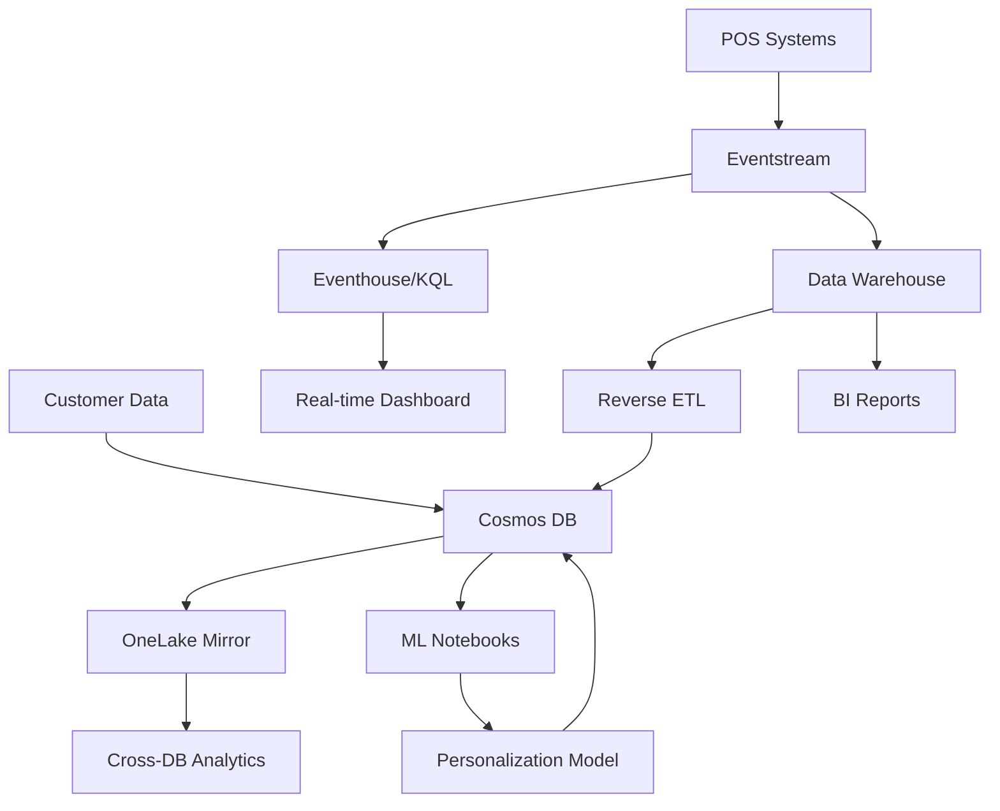

<p align="center">

</p>

# [Microsoft Ignite 2025](https://ignite.microsoft.com)

## 🔥LAB534: Build Real-Time Analytics with Cosmos DB in Microsoft Fabric

[](https://community.fabric.microsoft.com/)
[](https://learn.microsoft.com/fabric/)
[](https://discord.com/invite/ByRwuEEgH4)
[](https://aka.ms/foundry/forum)
### Session Description

Learn how to build a complete real-time analytics solution using Cosmos DB in Microsoft Fabric. This hands-on lab demonstrates how to create an operational data store, implement streaming data pipelines, build cross-database analytics, and deploy personalized recommendations using Reverse ETL patterns.

### 🧠 Learning Outcomes

By the end of this session, learners will be able to:

- **Provision and configure** Cosmos DB in Microsoft Fabric as an operational data store
- **Implement real-time streaming** using Eventstreams and KQL for POS transaction data
- **Build cross-database analytics** leveraging Cosmos DB's automatic mirroring to OneLake
- **Create data warehouses** and perform ETL operations from streaming to structured data
- **Implement Reverse ETL** patterns to update operational systems with analytical insights
- **Deploy personalized recommendation models** using machine learning and customer behavior data

### 💻 Technologies Used

1. **Microsoft Fabric** - Unified analytics platform
2. **Cosmos DB** - Operational NoSQL database
3. **Eventstreams & KQL** - Real-time data streaming and querying
4. **Data Warehouse** - Structured analytics storage
5. **PySpark Notebooks** - Data processing and machine learning
6. **OneLake** - Unified data lake storage

### 🌟 Microsoft Learn MCP Server

[](https://vscode.dev/redirect/mcp/install?name=microsoft.docs.mcp&config=%7B%22type%22%3A%22http%22%2C%22url%22%3A%22https%3A%2F%2Flearn.microsoft.com%2Fapi%2Fmcp%22%7D)

The Microsoft Learn MCP Server is a remote MCP Server that enables clients like GitHub Copilot and other AI agents to bring trusted and up-to-date information directly from Microsoft's official documentation. Get started by using the one-click button above for VSCode or access the [mcp.json](.vscode/mcp.json) file included in this repo.

For more information, setup instructions for other dev clients, and to post comments and questions, visit our Learn MCP Server GitHub repo at [https://github.com/MicrosoftDocs/MCP](https://github.com/MicrosoftDocs/MCP). Find other MCP Servers to connect your agent to at [https://mcp.azure.com](https://mcp.azure.com).

*Note: When you use the Learn MCP Server, you agree with [Microsoft Learn](https://learn.microsoft.com/en-us/legal/termsofuse) and [Microsoft API Terms](https://learn.microsoft.com/en-us/legal/microsoft-apis/terms-of-use) of Use.*

### 📚 Resources and Next Steps

| Resources          | Links                             | Description        |
|:-------------------|:----------------------------------|:-------------------|
| **Lab Instructions** | [Lab Exercises](./lab/instructions/) | Step-by-step hands-on lab exercises |
| **Sample Data** | [Data Files](./data/) | NoSQL, relational, and streaming sample datasets |
| **Notebooks** | [PySpark Notebooks](./src/notebooks/) | ML models for personalization and reverse ETL |
| **Source Code** | [Code Samples](./src/) | C# streaming applications and data loaders |
| Ignite 2025 Next Steps | [https://aka.ms/Ignite25-Next-Steps](https://aka.ms/Ignite25-Next-Steps?ocid=ignite25_nextsteps_cnl) | Links to all repos for Ignite 25 Sessions |
| Microsoft Fabric Community | [https://community.fabric.microsoft.com/](https://community.fabric.microsoft.com/) | Connect with the Microsoft Fabric Community! |
| Learn Microsoft Fabric | [https://learn.microsoft.com/fabric/](https://learn.microsoft.com/fabric/) | Comprehensive Fabric documentation and tutorials |
| Cosmos DB in Fabric | [https://learn.microsoft.com/fabric/database/cosmos-db/](https://learn.microsoft.com/fabric/database/cosmos-db/) | Cosmos DB integration with Microsoft Fabric |

## 🏗️ Lab Architecture

This lab implements a modern real-time analytics architecture using Microsoft Fabric:



### 🔄 Data Flow Overview

1. **Operational Layer**: Cosmos DB stores customer profiles and transaction data
2. **Streaming Layer**: Eventstreams capture real-time POS transactions  
3. **Analytics Layer**: Data Warehouse provides structured analytics storage
4. **Intelligence Layer**: ML notebooks generate personalized recommendations
5. **Reverse ETL**: Analytics insights flow back to operational systems

## 📋 Lab Exercises

This hands-on lab consists of 5 progressive exercises:

| Exercise | Focus Area | Duration | Key Technologies |
|:---------|:-----------|:---------|:-----------------|
|**[Fabric Environment Setup](./lab/instructions/fabric-environment-setup.md)**| Fabric Environment Setup | 10 min | Terminal, Microsoft Fabric |
| **[Exercise 1](./lab/instructions/exercise-1.md)** | Provisioning Cosmos DB in Fabric  | 15 min | Cosmos DB, NoSQL containers |
| **[Exercise 2](./lab/instructions/exercise-2.md)** | Cross-Database Analytics | 20 min | SQL Endpoint, OneLake mirroring |
| **[Exercise 3](./lab/instructions/exercise-3.md)** | Real-Time Streaming | 25 min | Eventstreams, KQL, Eventhouse |
| **[Exercise 4](./lab/instructions/exercise-4.md)** | Reverse ETL & ML | 30 min | Data Warehouse, PySpark, Fabric Notebooks |
| **[Exercise 5](./lab/instructions/exercise-5.md)** | Serve Personalized Recommendations from Cosmos DB | 20 min | C#, Cosmos DB in Fabric |

**Total Lab Time**: ~2 hours

### 🎯 Prerequisites

- Access to Microsoft Fabric workspace with appropriate permissions
- Basic familiarity with SQL, NoSQL databases, and data analytics concepts
- Understanding of JSON data structures and REST APIs

## 🚀 Getting Started

1. **Clone this repository** to your local development environment
2. **Access Microsoft Fabric** and create a new workspace for this lab
3. **Start with Exercise 1** by following the [Lab Instructions](./lab/instructions/)
4. **Use the provided sample data** from the [data](./data/) folder
5. **Deploy notebooks and code** from the [src](./src/) folder as needed

### 🗂️ Repository Structure

```
├── 📁 data/                          # Sample datasets
│   ├── 📁 nosql/                     # Customer data for Cosmos DB
│   ├── 📁 relational/                # Dimensional data for warehouse
│   └── 📁 streaming/                 # Real-time transaction generators
├── 📁 lab/                           # Lab exercise instructions
│   └── 📁 instructions/              # Step-by-step exercise guides
├── 📁 src/                           # Source code and notebooks
│   ├── 📁 notebooks/                 # PySpark ML notebooks
│   └── 📁 warehouse_setup/           # C# data loading utilities
└── 📁 docs/                          # Additional documentation
```

## Content Owners


<!-- TODO: Add yourself as a content owner
1. Change the src in the image tag to {your github url}.png
2. Change INSERT NAME HERE to your name
3. Change the github url in the final href to your url. -->

<table>
<tr>
    <td align="center"><a href="http://github.com/paladique">
        <br />
        <sub><b>Jasmine Greenaway
</b></sub></a><br />
            <a href="https://github.com/mikekinsman" title="talk">📢</a> 
    </td>
    <td align="center"><a href="http://github.com/jcardif">
        <br />
        <sub><b>Josh Ndemenge
</b></sub></a><br />
            <a href="https://github.com/jcardif" title="talk">📢</a> 
    </td>
</tr></table>


## Contributing

This project welcomes contributions and suggestions.  Most contributions require you to agree to a
Contributor License Agreement (CLA) declaring that you have the right to, and actually do, grant us
the rights to use your contribution. For details, visit [Contributor License Agreements](https://cla.opensource.microsoft.com).

When you submit a pull request, a CLA bot will automatically determine whether you need to provide
a CLA and decorate the PR appropriately (e.g., status check, comment). Simply follow the instructions
provided by the bot. You will only need to do this once across all repos using our CLA.

This project has adopted the [Microsoft Open Source Code of Conduct](https://opensource.microsoft.com/codeofconduct/).
For more information see the [Code of Conduct FAQ](https://opensource.microsoft.com/codeofconduct/faq/) or
contact [opencode@microsoft.com](mailto:opencode@microsoft.com) with any additional questions or comments.

## Trademarks

This project may contain trademarks or logos for projects, products, or services. Authorized use of Microsoft
trademarks or logos is subject to and must follow
[Microsoft's Trademark & Brand Guidelines](https://www.microsoft.com/legal/intellectualproperty/trademarks/usage/general).
Use of Microsoft trademarks or logos in modified versions of this project must not cause confusion or imply Microsoft sponsorship.
Any use of third-party trademarks or logos are subject to those third-party's policies.
