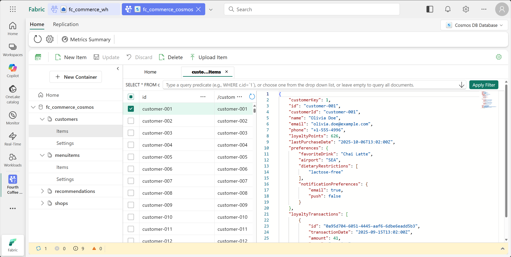
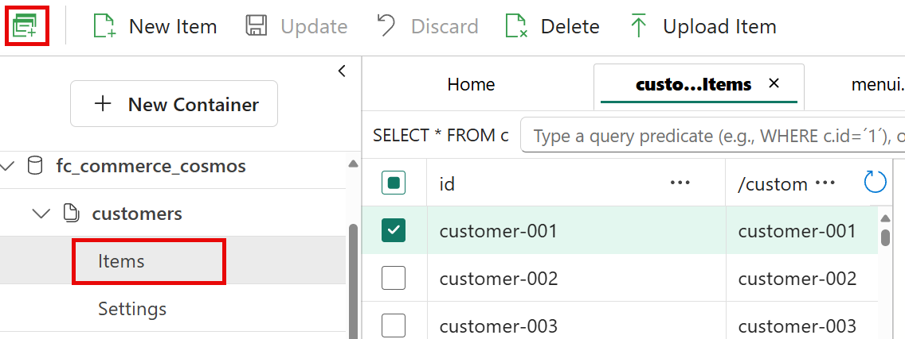
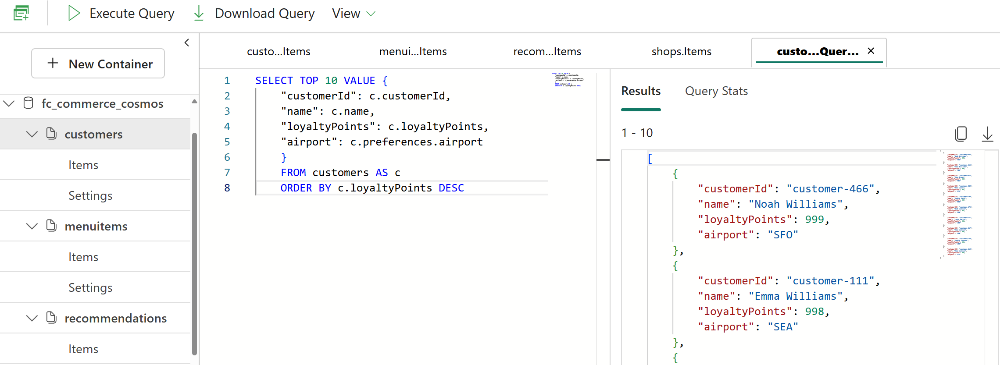

# Exercise 1: Provisioning Cosmos DB in Fabric (Operational Data Store)

This is the first exercise in the lab where you will create a Cosmos DB database in Microsoft Fabric to serve as the operational data store for Fourth Coffee's commerce application.

## Create the database

1. Browse to the Fabric workspace you created in the previous step by selecting it from the left navigation pane if it is already open, or selecting **Workspaces** on the left navigation pane and then selecting it.

1. From the top menu ribbon, select **+ New item**, a pane will open on the right side and on the filter text box on the top right of the pane, type +++*cosmos*+++ to filter the list of items. Select **Cosmos DB (Preview)**.

    

1. Name the new database +++*fc_commerce_cosmos*+++ and select **Create**.

1. Once the Cosmos DB database has been created, it will open in a new tab in Fabric.

## Create the containers

1. On the left explorer pane, select **+ New container**.

1. In the **New container** pane that opens on the right side, provide the following details to create a new **customers** container:

    - **Container id**: +++*customers*+++
    - **Partition key**: +++*/customerId*+++

    Select **OK** to create the container.

1. Once the container has been created, repeat the previous step to create the following additional containers:

    1. **Recommendations** container
        - **Container id**: +++*recommendations*+++
        - **Partition key**: +++*/customerId*+++

    1. **Menu Items** container
        - **Container id**: +++*menuitems*+++
        - **Partition key**: +++*/shopId*+++

    1. **Shops** container
        - **Container id**: +++*shops*+++
        - **Partition key**: +++*/airportId*+++

## Load initial data

You will now load initial data into the Cosmos DB containers you just created by uploading JSON files.

1. On the left explorer pane, select the **customers** container to open it then select **items**.

1. From the top menu ribbon, select **Upload item**. On the **Upload item** pane that opens on the right side, select the folder icon to browse for the file to upload.

1. On the file picker dialog, navigate to the lab repo folder on the desktop at **Desktop > lab-534 > data > nosql > customers_container.json**, select the file and then select **Open**.

1. Back on the **Upload item** pane, select **Upload** to upload the file. Once the upload is complete, you will see the items listed in the container.

    

1. Repeat the previous steps to upload the following files into their respective containers:

    - **recommendations** container: *recommendations_container.json*
    - **menuitems** container: *menu_container.json*
    - **shops** container: *shops_container.json*

## Query the data

Let's perform some queries against the data you just uploaded to verify that everything is working as expected.

1. Select the **Items** tab inside the **customers** container. On the top menu ribbon, select **New SQL query**.

    

1. In the query editor that opens, enter the following query to retrieve the top ten high value customers based on their total loyalty points:

    +++*SELECT TOP 10 VALUE {
    "customerId": c.customerId,
    "name": c.name,
    "loyaltyPoints": c.loyaltyPoints,
    "airport": c.preferences.airport
    }
    FROM customers AS c
    ORDER BY c.loyaltyPoints DESC*+++

1. Select the **Execute Query** button on the top menu ribbon to run the query. You should see the results displayed below the query editor.

    > [!TIP]
    > You can select the **View** dropdown on the top menu ribbon then select **Vertical** to change the results view to vertical for better readability.

    

1. Create another new SQL query in the same **customers** container to analyze the loyalty accounts for customers. Enter the following query in the query editor and execute it:

    +++*SELECT c.customerId,
        (SELECT VALUE SUM(t.amount) FROM t IN c.loyaltyTransactions WHERE t.type = "earning")    AS totalEarned,
        (SELECT VALUE SUM(t.amount) FROM t IN c.loyaltyTransactions WHERE t.type = "redemption") AS totalRedeemed
       FROM customers c*+++

This query contains two correlated subqueries to calculate the total loyalty points earned and redeemed for each customer based on their loyalty transactions.

Cosmos DB in Fabric supports rich querying capabilities including subqueries *(as demonstrated above)*, aggregate functions, scalar expressions, and more, enabling you to perform complex data analysis directly within the database.

1. In a new query editor, enter the following query to demonstrate scalar expressions. This query calculates a customer's membership tier based on their total loyalty points:

    +++*SELECT c.customerId,
        c.name,
        c.loyaltyPoints,
            IIF(c.loyaltyPoints >= 1000, "Gold",
                IIF(c.loyaltyPoints >= 500, "Silver", "Bronze")) AS membershipTier
        FROM customers c*+++

## Next step

> Select **Next >** in these instructions to go to the next part of the lab: **Exercise 2:Batch Data Loading and Cross-Database Analytics (Cosmos DB to Data Warehouse)**
