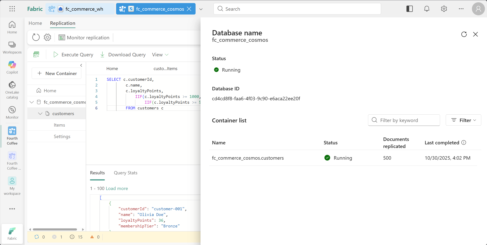
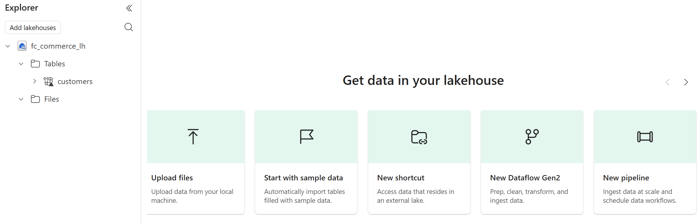

# Exercise 2: Cross-Database Analytics (Cosmos DB to Data Warehouse)

In this exercise, you will explore how Cosmos DB in Microsoft Fabric automatically mirrors your data to OneLake, allowing for cross-database querying. You will also learn how to Cosmos DB integrates with other services within Fabric, such as lakehouses, notebooks, power BI etc.

By the end of this exercise, you'll be able to:

- Access Cosmos DB mirrored data in OneLake
- Query Cosmos DB data using the SQL analytics endpoint
- Build a scheduled notebook to perform batch data loading from Cosmos DB to a Fabric Data Warehouse

## Access Cosmos DB mirrored data in OneLake

>[!TIP]
>Every Cosmos DB database in Fabric is automatically mirrored to OneLake in Delta Lake format—no ETL pipelines required. This tight integration makes operational data instantly analytics-ready across all Fabric services.

1. First, check the status of replication for your Cosmos DB database in OneLake. In the **fc_commerce_cosmos** Cosmos DB, select the **Replication** tab from the top menu bar, then select **Monitor replication**.This opens a pane on the right showing the replication status.

    

1. Close the replication status pane. From the top menu bar select the **Cosmos DB** dropdown and then select **SQL Endpoint**.

    

1. This opens a new tab in Fabric to the SQL analytics endpoint page for your Cosmos DB database. In the left explorer pane, expand **Schemas > fc_commerce_cosmos > Tables**.

    Here you will see the container you created in Exercise 1, represented as a table.

1. From the top menu ribbon, select **New SQL query**. In the query editor that opens, enter the following query to analyze customer preferences by grouping customers by their favorite drink:

    +++*SELECT
            JSON_VALUE(c.preferences, '$.favoriteDrink') AS drink,
            COUNT(1) AS customerCount
        FROM [fc_commerce_cosmos].[fc_commerce_cosmos].[customers] AS c
        GROUP BY JSON_VALUE(c.preferences, '$.favoriteDrink')
        ORDER BY COUNT(1) DESC*+++

1. Select **Run** to execute the query. The results will show the most popular drinks ordered by customer count, with the most popular drinks appearing first.

    

    The SQL analytics endpoint allows you to run T-SQL queries against your mirrored Cosmos DB data, making it easy to perform analytics without impacting your operational workloads.

## Cross-database querying Cosmos DB and Fabric Data Warehouse

1. In the same analytics endpoint tab, select **+ Warehouses** in the Explorer pane, then select the **fc_commerce_wh** Data Warehouse you created in the Fabric Environment Setup.

1. Open a new SQL query editor, then enter the following query to analyze which favorite drinks drive the most revenue and loyalty engagement by combining data from both Cosmos DB and the Data Warehouse:

    +++*SELECT
        JSON_VALUE(c.preferences, '$.favoriteDrink') AS FavoriteDrink,
        COUNT(DISTINCT c.customerId) AS TotalCustomers,
        AVG(CAST(c.loyaltyPoints AS decimal(10,2))) AS AvgLoyaltyPoints,
        SUM(COALESCE(fs.TotalAmount, 0.0)) AS TotalRevenue,
        SUM(COALESCE(fs.LoyaltyPointsEarned, 0)) AS TotalPointsEarned,
        SUM(COALESCE(fs.LoyaltyPointsRedeemed, 0)) AS TotalPointsRedeemed,
        AVG(CAST(fs.TotalQuantity AS decimal(10,2))) AS AvgItemsPerOrder,
        COUNT(DISTINCT fs.TransactionId) AS TotalTransactions
    FROM [fc_commerce_cosmos].[fc_commerce_cosmos].[customers] AS c
    LEFT JOIN [fc_commerce_wh].[dbo].[DimCustomer] AS dc
        ON dc.CustomerId = c.customerId
    LEFT JOIN [fc_commerce_wh].[dbo].[FactSales] AS fs
        ON fs.CustomerKey = dc.CustomerKey
    WHERE JSON_VALUE(c.preferences, '$.favoriteDrink') IS NOT NULL
    GROUP BY JSON_VALUE(c.preferences, '$.favoriteDrink')
    ORDER BY TotalRevenue DESC;*+++

1. Select **Run** to execute the query. This cross-database query demonstrates the power of Fabric's unified analytics platform by seamlessly joining:
    - Customer preference data from Cosmos DB (`customers` container)
    - Sales transaction data from the Data Warehouse (`FactSales` table)
    - Menu item data from Cosmos DB (`menuitems` container)

    

## Access mirrored data from a Fabric Lakehouse

1. Navigate back to the workspace and select the **fc_commerce_lh** lakehouse that was created during the Fabric Environment Setup.

1. Right-click the **Tables** folder from the lakehouse explorer pane, then select **New shortcut**.

1. In the **New shortcut** dialog, select **Microsoft OneLake**.

1. In the **Select a data source type** dialog, select the **fc_commerce_cosmos** database from the list of available OneLake data sources, then select **Next**.

1. On the next page, expand **Tables** > **fc_commerce_cosmos** schema, then select the mirrored **customers** container. Select **Next**.

1. On the final page, review the summary and select **Create** to create the table shortcuts in the lakehouse.

    

1. Once the data is in the lakehouse, you can use it in various Fabric services. For example, you can create a notebook to analyze the data.

1. From the top menu ribbon, select **Open notebook** dropdown, then select **New notebook**.

1. In a new code cell, enter the following code and  run it:

    +++*display(spark.sql("""
SELECT
    get_json_object(c.preferences, '$.favoriteDrink') AS FavoriteDrink,
    COUNT(*) AS CustomerCount,
    AVG(CAST(c.loyaltyPoints AS float)) AS AvgLoyaltyPoints
FROM customers AS c
WHERE get_json_object(c.preferences, '$.favoriteDrink') IS NOT NULL
GROUP BY get_json_object(c.preferences, '$.favoriteDrink')
ORDER BY CustomerCount DESC
"""))*+++

    This code uses Spark SQL to query the mirrored Cosmos DB data in the lakehouse, analyzing customer preferences by favorite drink.

    

## Next step

> Select **Next >** in these instructions to go to the next part of the lab: **Exercise 3: Real-Time Streaming of POS Events**.
