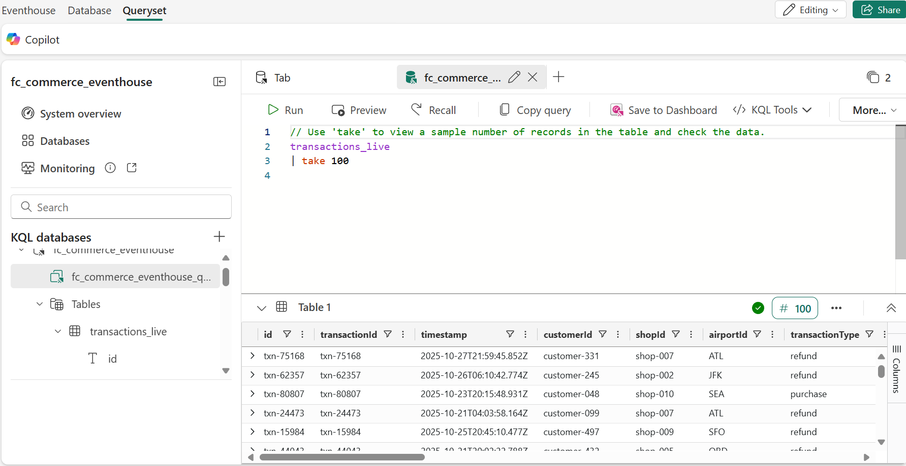
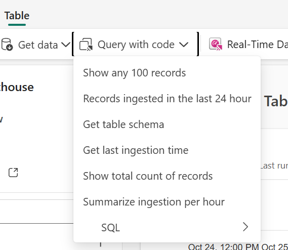
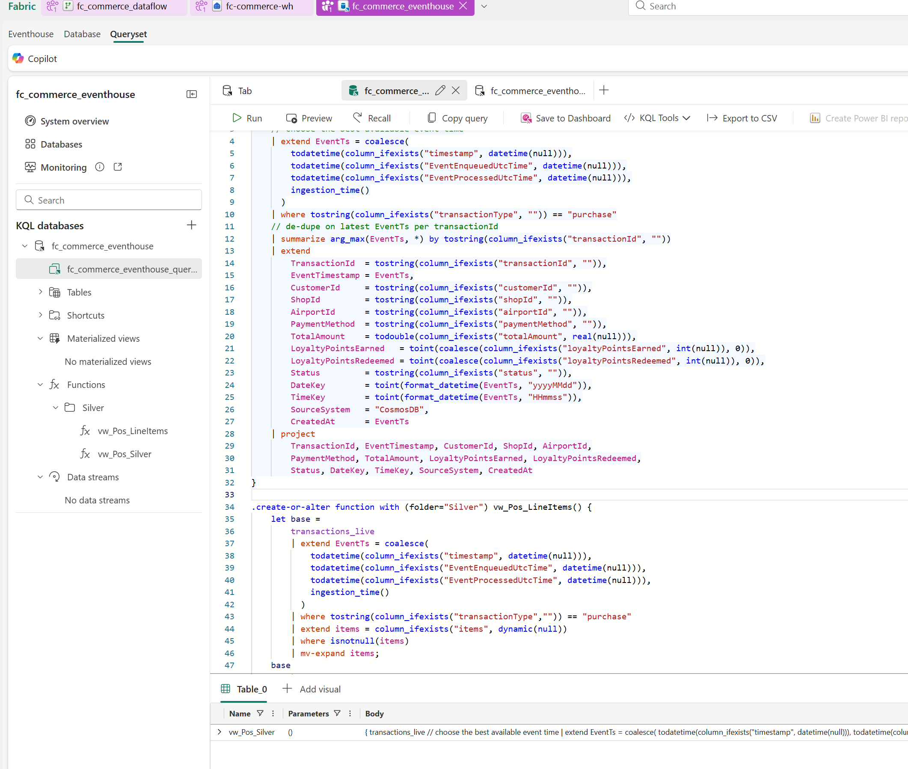

# Exercise 3: Real-Time Streaming of POS Events

In this exercise, you will ingest and query the streaming data and use the Kusto Query Language (KQL) to analyze it.

By the end of this exercise, you'll be able to:

- Store streaming data in an Eventhouse
- Query streaming data using the Kusto Query Language (KQL)
- Build a Silver layer for analytics using KQL functions

## Create an Eventhouse

1. In the same terminal window from the environment setup run the following command to execute the C# file that will create an Eventstream and generate streaming data:
   +++*dotnet run .\src\warehouse_setup\FabricPOSDatatStreaming.cs*+++
   
1. You have already created an Eventstream in the Fabric Environment Setup exercise. You will now create an Eventhouse to ingest and store the streaming data. Navigate to your Fabric workspace and select **+ New item** from the top menu ribbon.

1. In the **New item** pane that opens on the right side, type +++*eventhouse*+++ in the filter text box on the top right of the pane to filter the list of items. Select **Eventhouse (Preview)**.

    

1. Name the new Eventhouse +++*fc_commerce_eventhouse*+++ and select **Create**.

    

1. Once the Eventhouse has been created, it will open in a new tab in Fabric.
    

## Connect your Eventstream output to a KQL Database

1. In Fabric, open your Eventstream.

1. Hover over to the right of the eventstream name and select the **+** icon. It will open a context menu.

1. Scroll down and select **Eventhouse**.

    

1. You will now see a new eventhouse node connected to your eventstream.

1. Select the edit icon (pencil) on the eventhouse node to configure the destination.

    

1. Selecting the edit option will open a new pane on the right. Here, you will configure the Eventhouse destination. Enter the following details:

    1. Verify that the data ingestion mode is set to **Event processing before ingestion**.

1. For the Destination name, enter +++*fc-eventhouse*+++.

1. Select your workspace, this should be the workspace that your eventstream is in.

1. Select the Eventhouse you created earlier, +++*fc_commerce_eventhouse*+++.

1. For the KQL Database, select  +++*fc_commerce_eventhouse*+++.

1. For the KQL Destination Table, select **Create new** below the empty dropdown and enter the name +++*transactions_live*+++ and select **Done**.

    

1. Verify Input data format is set to **JSON**.

1. Verify **Activate ingestion after adding the data source** is checked.

1. Select **Save** to create the Eventhouse destination.

    

1. From the top menu ribbon select **Publish** to publish the changes to your eventstream.

    

## Verify live ingestion into Eventhouse and run KQL queries

> [!TIP]
> It may take a few minutes for data to start flowing into the Eventhouse. If you do not see any data when you run the query below, wait a few minutes and try again.

1. Navigate to your Eventhouse tab in Fabric.

    

1. Select the **fc_commerce_eventhouse** database from the left explorer pane.
1. In the database, select the **transactions_live** table.

    

1. In the top ribbon select **Query with code** button and select *Show any 100 records* from the dropdown.
    

1. In the new query editor tab, select **Run** to verify that data is being ingested into the Eventhouse in real-time.

    

## Build the Silver Layer for Analytics

1. Replace the existing query in the query editor with the following KQL code to create a Silver layer table that aggregates total sales by menu item:

```
.create-or-alter function with (folder="Silver") vw_Pos_Sales() {
    transactions_live
    // best available event timestamp
    | extend EventTs = coalesce(
        todatetime(column_ifexists("timestamp", datetime(null))),
        todatetime(column_ifexists("EventEnqueuedUtcTime", datetime(null))),
        todatetime(column_ifexists("EventProcessedUtcTime", datetime(null))),
        ingestion_time()
      )
    // purchases only
    | where tostring(column_ifexists("transactionType","")) == "purchase"
    // project needed fields and make sure Items is an array (empty if missing)
    | project
        TransactionId = tostring(column_ifexists("transactionId","")),
        EventTs,
        CustomerId = tostring(column_ifexists("customerId","")),
        ShopId     = tostring(column_ifexists("shopId","")),
        PaymentMethod = tostring(column_ifexists("paymentMethod","")),
        Items = iif(isnull(column_ifexists("items", dynamic(null))), dynamic([]), column_ifexists("items", dynamic(null))),
        // optional top-level totals (may be null)
        TotalQuantity_t = toint(column_ifexists("totalQuantity", int(null))),
        TotalAmount_t   = todouble(column_ifexists("totalAmount",  real(null))),
        LoyaltyPointsEarned   = toint(coalesce(column_ifexists("loyaltyPointsEarned", int(null)), 0)),
        LoyaltyPointsRedeemed = toint(coalesce(column_ifexists("loyaltyPointsRedeemed", int(null)), 0))
    // explode items (works even if empty array)
    | mv-expand Items to typeof(dynamic)
    | extend
        qty  = toint(coalesce(Items.quantity, 0)),
        unit = todouble(coalesce(Items.unitPrice, 0.0))
    | extend
        lt   = todouble(coalesce(Items.totalPrice, qty * unit))
    // roll up per transaction
    | summarize
        TotalQuantity_i = sum(qty),
        TotalAmount_i   = sum(lt),
        EventTimestamp  = any(EventTs),
        CustomerId      = any(CustomerId),
        ShopId          = any(ShopId),
        PaymentMethod   = any(PaymentMethod),
        LoyaltyPointsEarned   = any(LoyaltyPointsEarned),
        LoyaltyPointsRedeemed = any(LoyaltyPointsRedeemed),
        TotalQuantity_t = any(TotalQuantity_t),
        TotalAmount_t   = any(TotalAmount_t)
      by TransactionId
    // prefer top-level totals when present; else use item-derived
    | extend
        TotalQuantity = iif(isnotnull(TotalQuantity_t), TotalQuantity_t, TotalQuantity_i),
        TotalAmount   = iif(isnotnull(TotalAmount_t),   TotalAmount_t,   TotalAmount_i),
        DateKey   = toint(format_datetime(EventTimestamp, "yyyyMMdd")),
        TimeKey   = toint(format_datetime(EventTimestamp, "HHmmss")),
        CreatedAt = EventTimestamp
    | project
        TransactionId, DateKey, TimeKey,
        CustomerId, ShopId,
        TotalQuantity, TotalAmount,
        PaymentMethod,
        LoyaltyPointsEarned, LoyaltyPointsRedeemed,
        CreatedAt
}

.create-or-alter function with (folder="Silver") vw_Pos_LineItems_Sales() {
    transactions_live
    | extend EventTs = coalesce(
        todatetime(column_ifexists("timestamp", datetime(null))),
        todatetime(column_ifexists("EventEnqueuedUtcTime", datetime(null))),
        todatetime(column_ifexists("EventProcessedUtcTime", datetime(null))),
        ingestion_time()
      )
    | where tostring(column_ifexists("transactionType","")) == "purchase"
    | extend Items = column_ifexists("items", dynamic(null))
    | where isnotnull(Items)
    | mv-expand Items to typeof(dynamic)
    | extend
        TransactionId  = tostring(column_ifexists("transactionId","")),
        EventTimestamp = EventTs,
        CustomerId     = tostring(column_ifexists("customerId","")),
        ShopId         = tostring(column_ifexists("shopId","")),
        MenuItemKey    = toint(coalesce(Items.menuItemKey, int(null))),
        MenuItemId     = tostring(Items.menuItemId),
        Size           = tostring(coalesce(Items.size, "")),
        Quantity       = toint(coalesce(Items.quantity, 1)),
        UnitPrice      = todouble(coalesce(Items.unitPrice, 0.0))
    | extend LineTotal    = todouble(coalesce(Items.totalPrice, Quantity * UnitPrice)),
             PaymentMethod = tostring(column_ifexists("paymentMethod",""))
    | order by TransactionId asc, EventTimestamp asc, MenuItemId asc, Size asc
    | serialize
    | extend LineNumber = row_number(1, prev(TransactionId) != TransactionId)
    | extend
        DateKey  = toint(format_datetime(EventTimestamp, "yyyyMMdd")),
        TimeKey  = toint(format_datetime(EventTimestamp, "HHmmss")),
        CreatedAt = EventTs
    | project
        TransactionId, LineNumber,
        DateKey, TimeKey,
        // keep if you merge to Customer/Shop keys upstream; drop if not needed
        CustomerId, ShopId,
        MenuItemKey, MenuItemId,
        Quantity, UnitPrice, LineTotal,
        PaymentMethod, Size, CreatedAt
}
```

1. Execute each query by highlighting one at a time (this can be achieved by adding your cursor anywhere in the query), then selecting **Run** to execute the code to create the Silver layer functions.


1. You can now query the Silver layer views to perform analytics on the ingested streaming data. For example, to get total sales by menu item, use the following query:

```
vw_Pos_LineItems_Sales()
| summarize TotalSales = sum(LineTotal), TotalQuantity = sum(Quantity) by MenuItemId, ItemName
| order by TotalSales desc
```

1. Select **Run** to execute the query and view the results.
   
> Select **Next >** in these instructions to go to the next part of the lab: **Exercise 4: Implement Reverse ETL and Build Personalization Model**.

