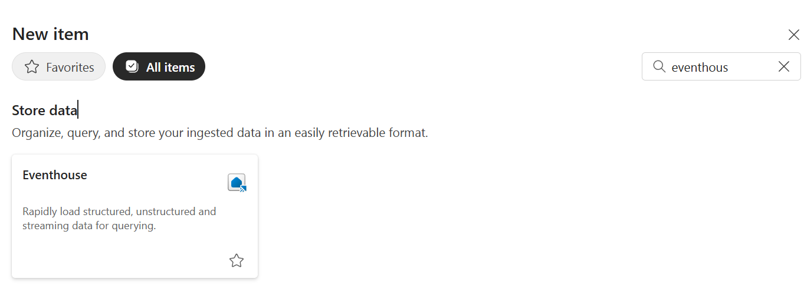

# Real-Time Streaming of POS Events

In this exercise, you will ingest, transform, and query the streaming data and apply medallion architecture.

By the end of this exercise, you'll be able to:

- Perform Transformations on streaming data within an eventstream
- Architect a medalliion archtectioe 
- Set up an eventhouse
- Query streaming data using KQL 

## Create an Eventhouse

1. You have already created an Eventstream in the Fabric Environment Setup exercise. You will now create an Eventhouse to ingest and store the streaming data. Navigate to your Fabric workspace and select **+ New item** from the top menu ribbon.

1. In the **New item** pane that opens on the right side, type +++*eventhouse*+++ in the filter text box on the top right of the pane to filter the list of items. Select **Eventhouse (Preview)**.

    

1. Name the new Eventhouse +++*fc_commerce_eventhouse*+++ and select **Create**.

    

1. Once the Eventhouse has been created, it will open in a new tab in Fabric.
    

## Connect your Eventstream output to a KQL Database

1. In Fabric, open your Eventstream.

1. Hover over to the right of the eventstream name and select the **+** icon. It will open a context menu. 

1. Scroll down and select **Eventhouse**.

1. You will now see a new eventhouse node connected to your eventstream. 

1. Select the edit icon (pencil) on the eventhouse node to configure the destination.

1. Selecting the edit option will open a new pane on the right. Here, you will configure the Eventhouse destination. Enter the following details:

    1. Verify that the data ingestion mode is set to **Event processing before ingestion**.

    1. For the Destination name, enter +++*fc-eventhouse*+++.

    1. Select your workspace, this should be the workspace that your eventstream is in.

    1. Select the Eventhouse you created earlier, +++*fc_commerce_eventhouse*+++.

    1. For the KQL Database, select  +++*fc_commerce_eventhouse*+++.

    1. For the KQL Destination Table, select **Create new** below the empty dropdown and enter the name +++*transactions_live*+++ and select **Done**.
    
    
    
    1. Verify Input data format is set to **JSON**.

    1. Verify **Activate ingestion after adding the data source** is checked.

    1. Select **Save** to create the Eventhouse destination.

1. From the top menu ribbon select **Publish** to publish the changes to your eventstream.

## Verify live ingestion into Eventhouse and run KQL queries

> [!TIP]
> It may take a few minutes for data to start flowing into the Eventhouse. If you do not see any data when you run the query below, wait a few minutes and try again.

1. Navigate to your Eventhouse tab in Fabric.

1. Select the **fc_commerce_eventhouse** database from the left explorer pane.
1. In the database, select the **transactions_live** table.

1. In the top ribbon select **Query with code** button and select *Show any 100 records* from the dropdown.

1. In the new query editor tab, select **Run** to verify that data is being ingested into the Eventhouse in real-time.

