# Implement Reverse ETL and Build Personalization Model

In this exercise, you will create a Dataflow Gen2 to extract and transform data from the Eventhouse, update the user profiles in Cosmos DB, and then use that data to build a personalization model in a notebook.

by the end of this exercise, you'll be able to:

- Create a Dataflow Gen2 to extract and transform data
- Perform Reverse ETL to update user profiles in Cosmos DB

## Create Data Warehouse Views

1. In your Fabric workspace, navigate to the Data Warehouse where you want to create views.
1. Create a new SQL query by selecting the **New SQL Query** button in the warehouse page.

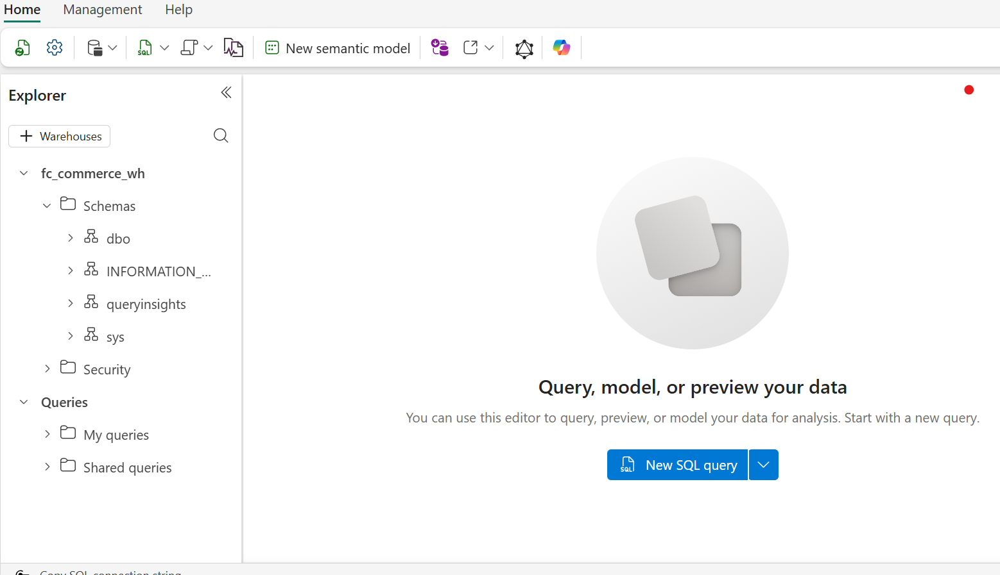

1. In the query window editor, paste the following SQL code to create views in the warehouse:

+++*CREATE OR ALTER VIEW dbo.vDimCustomerKey AS
SELECT CustomerId, CustomerKey, IsActive FROM dbo.DimCustomer;

CREATE OR ALTER VIEW dbo.vDimShopKey AS
SELECT ShopId, ShopKey, IsActive FROM dbo.DimShop;

CREATE OR ALTER VIEW dbo.vDimMenuItemKey AS
SELECT MenuItemId, MenuItemKey, IsActive FROM dbo.DimMenuItem;

CREATE OR ALTER VIEW dbo.vFactSalesMaxKey AS
SELECT
  MaxSalesKey = COALESCE(MAX(SalesKey), 0),
  ExistingTxnCount = COUNT(*)
FROM dbo.FactSales;*+++

1. Select **Run** to execute the query and create the views in the warehouse.

  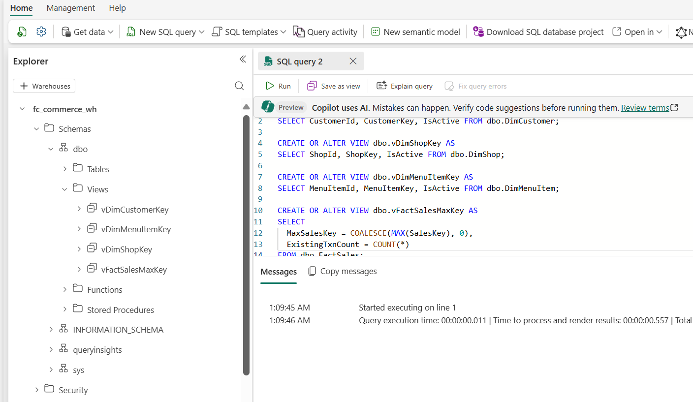

## Perform Transform and Load with Fabric Notebooks

1. Browse to the Fabric workspace you created in the previous steps by selecting it from the left navigation pane if it is already open, or selecting **Workspaces** on the left navigation pane and then selecting it.

1. From the top menu ribbon, select **+ New item**, a pane will open on the right side and on the filter text box on the top right of the pane, type +++*dataflow*+++ to filter the list of items. Select **Dataflow Gen2**.

  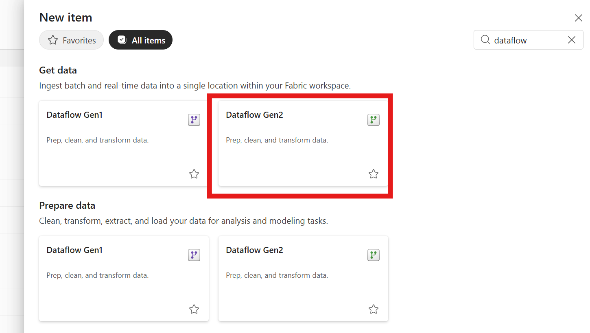

1. Name the new Dataflow +++*fc_commerce_dataflow*+++ and select **Create**.
1. Once the Dataflow Gen2 has been created, it will open in a new tab in Fabric.

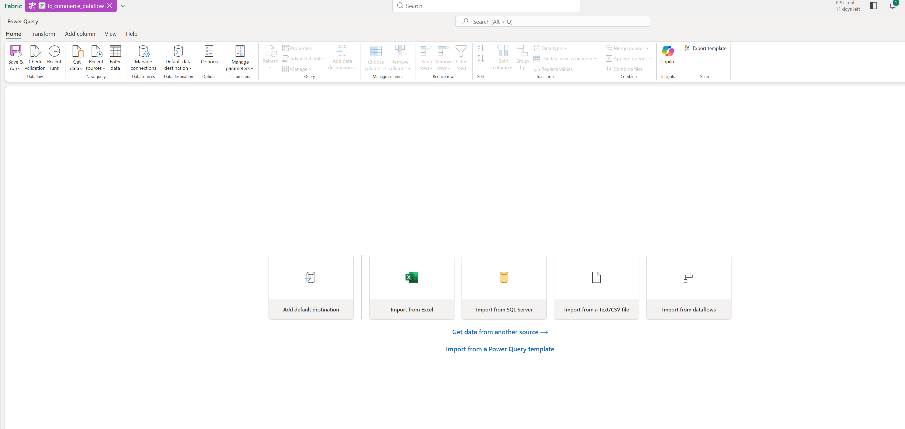

## Add Data Sources to Dataflow

1. In the Dataflow canvas, select **Get data from another source** to open the data source selection pane.
1. In the data source selection pane, type +++*eventhouse*+++ in the filter text box to filter the list of items. In the OneLake catalog view, select the eventhouse you created in the previous exercise, +++*fc_commerce_eventhouse*+++.

  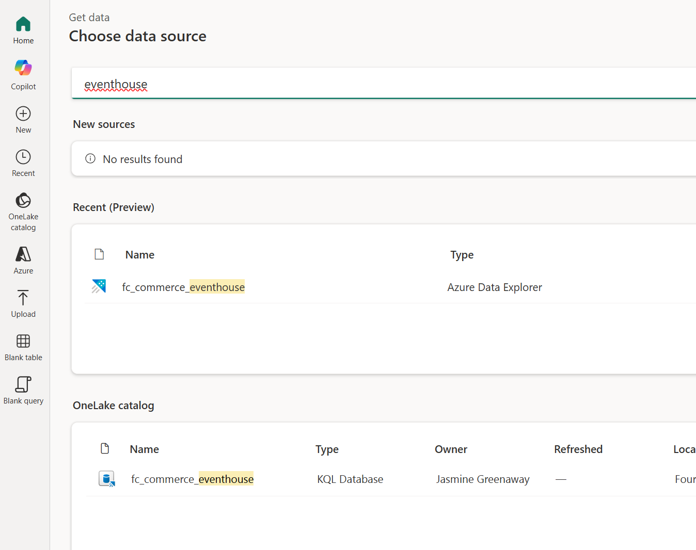

1. In the Choose data pane, expand the folder, then the database, then select the **vw_Pos_Sales** and **vw_Pos_LineItems_Sales** views. Select **Create**.

  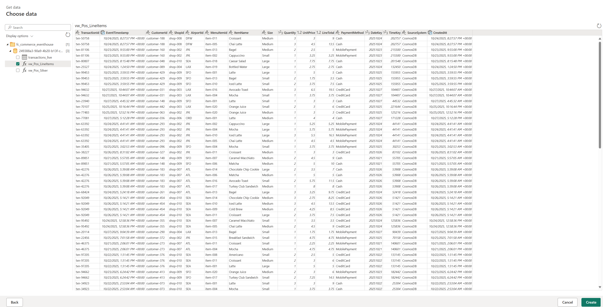

1. In the Dataflow canvas, you will see the two views added as source transformations.
1. In the top menu ribbon, select **New Query** > **Get data** to add another data source.
1. In the OneLake catalog view, type +++*fc_commerce_wh*+++ in the filter text box to filter the list of items. Select the data warehouse you created in the previous exercise, +++*fc_commerce_wh*+++.

  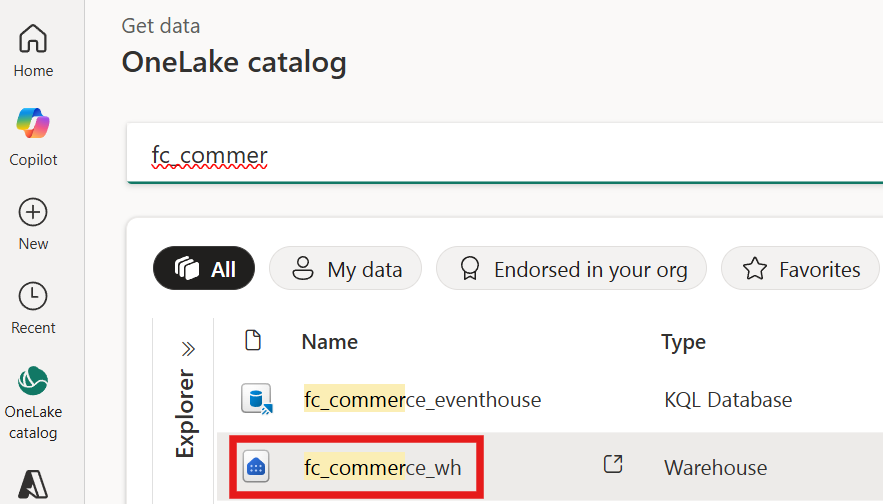

1. In the Choose data pane, expand the folder, then the database, then select the **vDimCustomerKey**, **vDimShopKey**, **vDimMenuItemKey**, and **vFactSalesMaxKey** views. Select **Create**.

  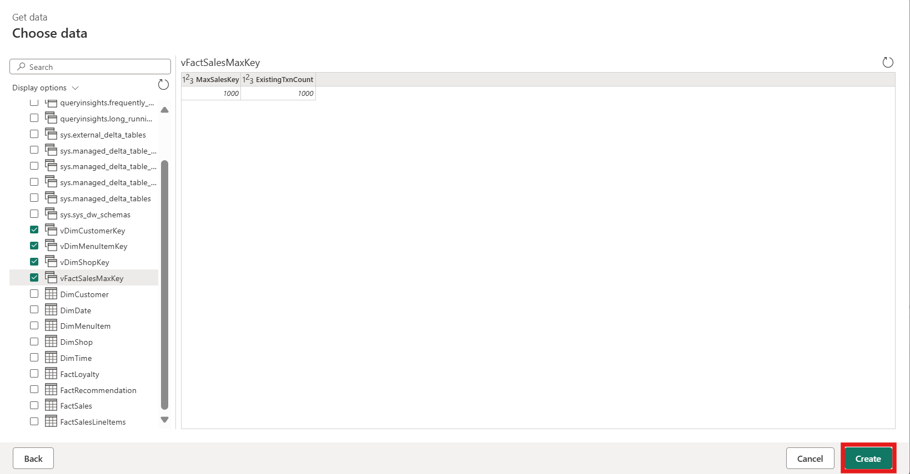

## Transform and Load Data in Dataflow

1. In the Dataflow canvas select *vw_Pos_Sales* to see the data preview and transformation options, then right click on the CreatedAt column header and select **Change type** > **Date/Time** from the dropdown.

  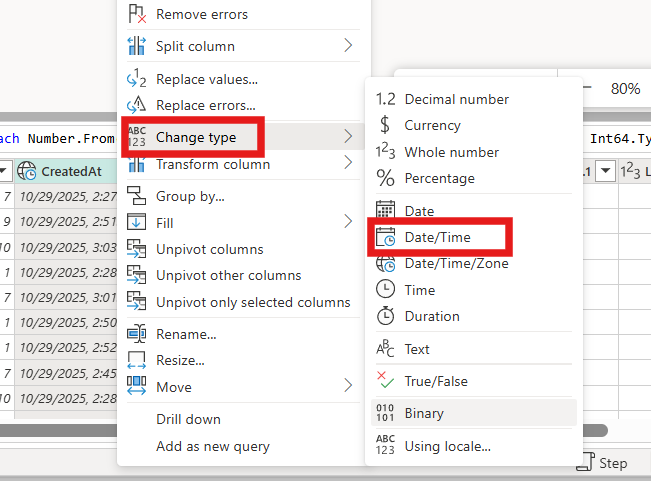

1. Right-click the +++*vw_Pos_Sales*+++ and select **Merge queries**.

  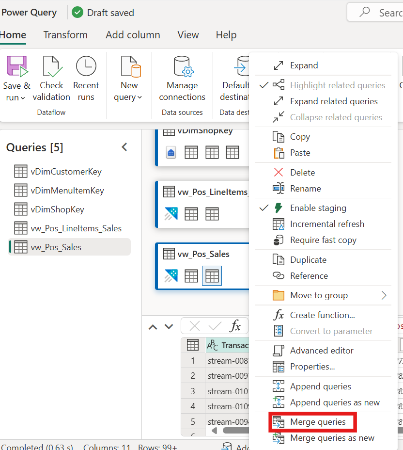

1. In the Merge pane, select +++*vDimCustomerKey*+++ as the second table to merge with.
1. Select the +++*CustomerId*+++ column from both tables by double clicking on the column names.
1. Verify that the Join kind is set to **Left outer (all from first, matching from second)** and select **OK**.

  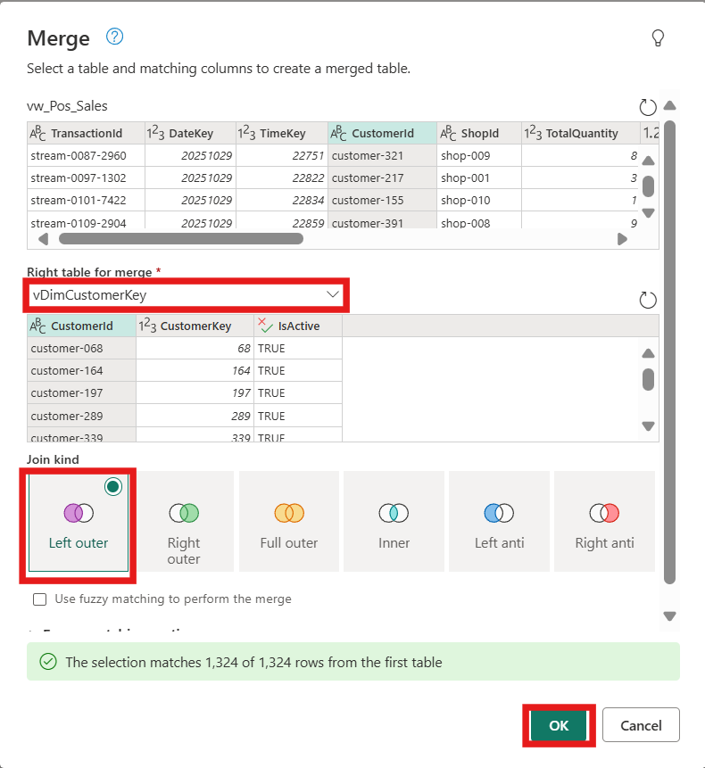

> [!TIP]
> At this stage you may recieve a warning message about data privacy levels before you can resume any transformations. You can safely select continue and check "Ignore privacy level check for this document" and select **Save** for the purposes of this lab.

1. In the new merged transformation, select the expand icon next to the **vDimCustomerKey** column header.

  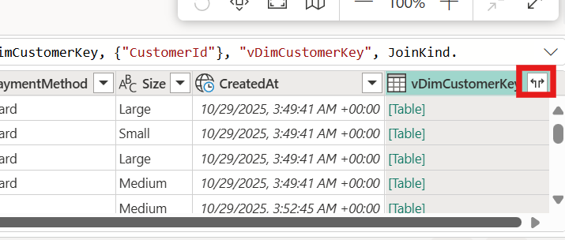

1. In the expand pane, deselect CustomerId, so CustomerKey and IsActive are selected. Select **OK**.
  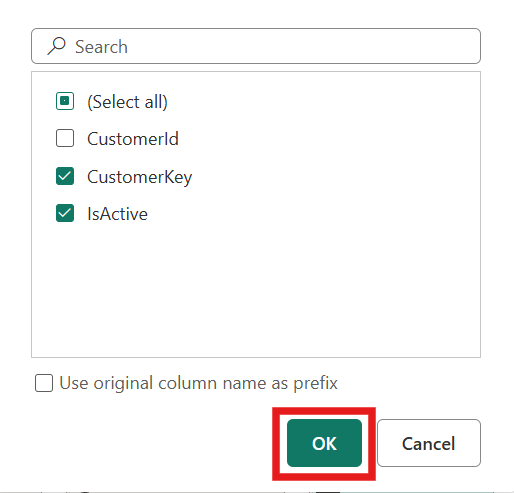

1. Repeat steps 1-6 to merge **vw_Pos_Sales** with **vDimShopKey** on **ShopId**. Expand the merged columns to include only the ShopKey and IsActive columns from each view.

  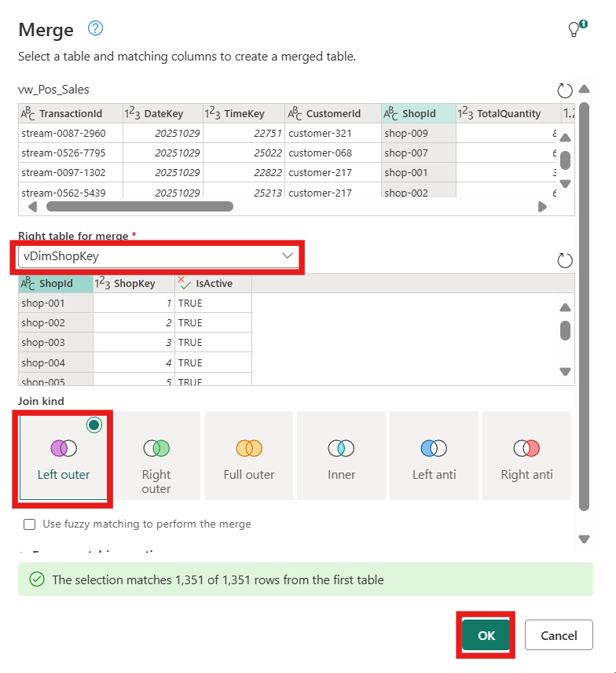

1. Your power query should now look like the following:

  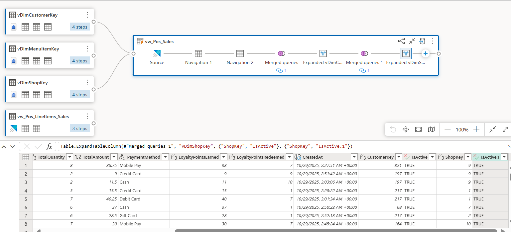

1. Select and highlight **vw_Pos_Sales**, then in the top menu ribbon select **Add Column** > **Index Column** > **From 1** from the dropdown to add another transformation step.

  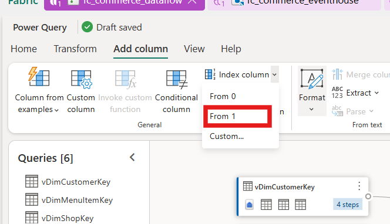

1. Right click on the new Index column header and select **Rename**, then enter the new name ++*LocalIndex*++ in the column header.

1. Next,verify **vw_Pos_Sales** transformation is selected and select **Add Column** > **Custom Column** from the top menu ribbon.
1. In the Custom Column pane, enter ++*MaxSalesKey*++ as the New column name.
1. Select **Whole Number** as the Data type.
1. In the Custom column formula box, enter the following formula to create a SalesKey based on the LocalIndex column:
+++*let
  t = dbo_vFactSalesMaxKey,
  v = if Table.RowCount(t) > 0
      then Record.Field(Table.First(t), "MaxSalesKey")
      else 0
in v*+++

  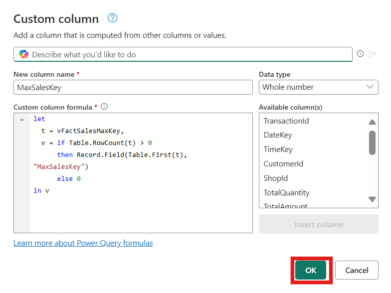

1. Select **OK** to create the new column.
1. Create another custom column by selecting **Add Column** > **Custom Column** from the top menu ribbon.
1. In the Custom Column pane, enter ++*SalesKey*++ as the New column name.
1. Select **Whole Number** as the Data type.
1. In the Custom column formula box, enter the following formula to create a SalesKey based on the LocalIndex column:
+++*Number.From([MaxSalesKey]) + Number.From([LocalIndex])*+++
1. Select **OK** to create the new column. SalesKey will be used as the primary key for the fact sales table and should start at 1001 if the MaxSalesKey in the warehouse is 1000.

  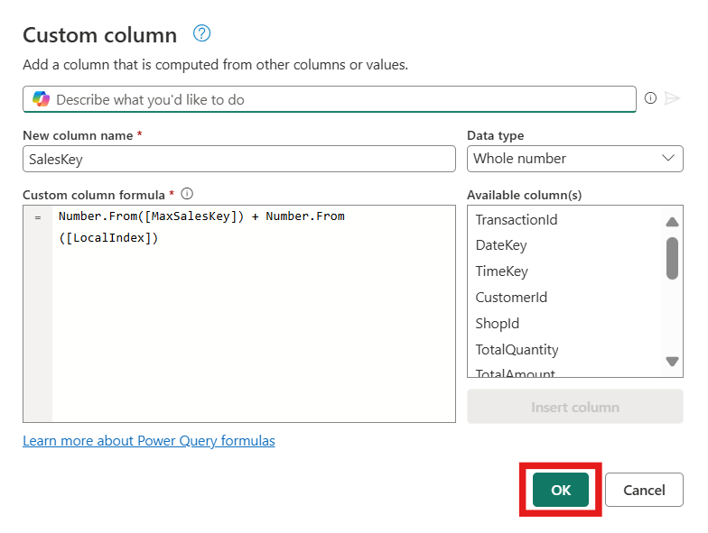

1. In the vw_Pos_Sales transformation, select the add destination icon in the top right corner of the transformation box and select **Warehouse**. This opens the destination pane.

  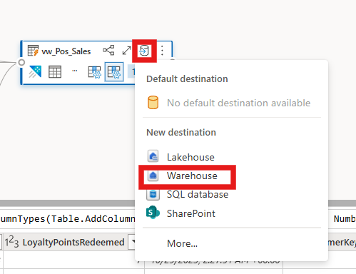

1. In the Connect to data destination pane, verify your warehouse connection is selected in connection credentials. It should be the only one there. Select **Next** to open the destination target pane.
1. Select **Existing table** is selected in the destination target pane.
1. Expand the warehouse folder and select *FactSales*.
1. Select **Next** to open the mapping pane.

  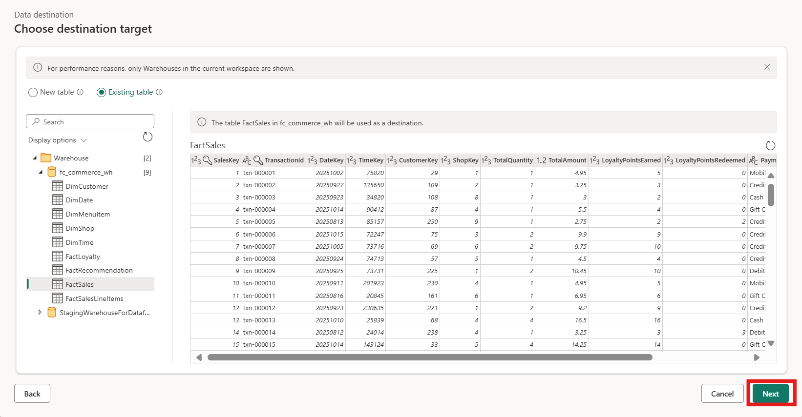

1. In the Choose destination settings pane, verify that the Update method is set to **Append**, and that all columns from the source are mapped to the destination.

1. Select **Save settings** to create the warehouse destination.

  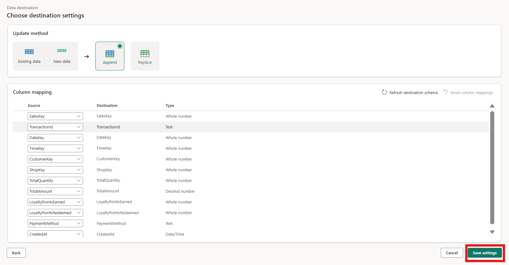

1. From the top menu ribbon, select **Publish** to publish the Dataflow changes.

1. In the Dataflow canvas select *vw_Pos_LineItems_Sales* to see the data preview and transformation options, then right click on the CreatedAt column header and select **Change type** > **Date/Time** from the dropdown, similar to the **vw_Pos_Sales** transformation.

  

1. Right-click the *vw_Pos_LineItems_Sales* and select **Merge queries**.

  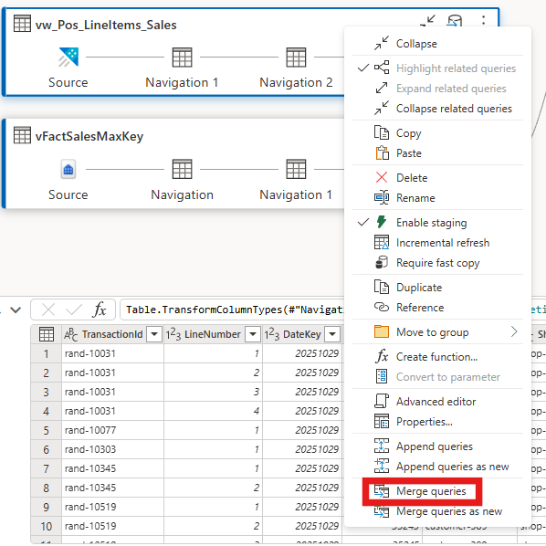

1. In the Merge pane, select *vDimMenuItemKey* as the second table to merge with.
1. Select the *MenuItemId* column from both tables by double clicking on the column names.
1. Verify that the Join kind is set to **Left outer (all from first, matching from second)** and select **OK**.
  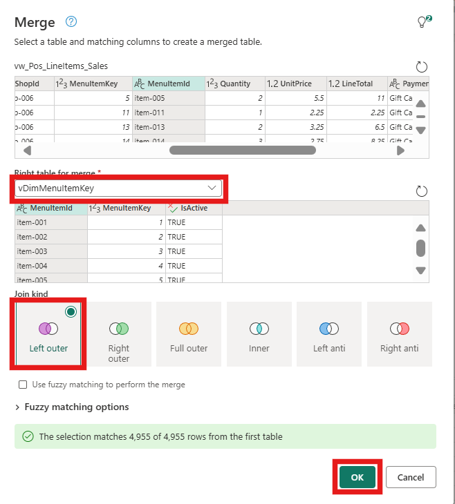

1. In the new merged transformation, select the expand icon next to the **vDimMenuItemKey** column header.
1. In the expand pane, deselect MenuItemId, so MenuItemKey and IsActive are selected. Select **OK**.
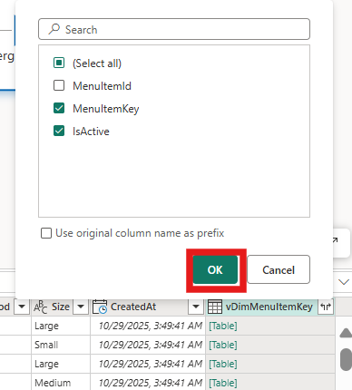

1. In the vw_Pos_LineItems_Sales transformation, select the add destination icon in the top right corner of the transformation box and select **Warehouse**. This opens the destination pane.

  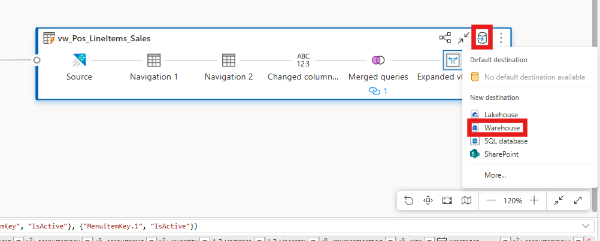

1. In the Connect to data destination pane, verify your warehouse connection is selected in connection credentials. It should be the only one there. Select **Next** to open the destination target pane.
1. Select **Existing table** is selected in the destination target pane.
1. Expand the warehouse folder and select *FactLineItems*.
1. Select **Next** to open the mapping pane.

  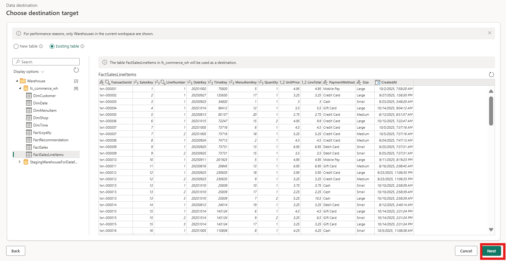

1. In the Choose destination settings pane, verify that the Update method is set to **Append**, and that all columns from the source are mapped to the destination.

1. Select **Save settings** to create the warehouse destination. (todo: update image)

  

1. From the top menu ribbon, select **Save and Run** to publish the Dataflow changes.

  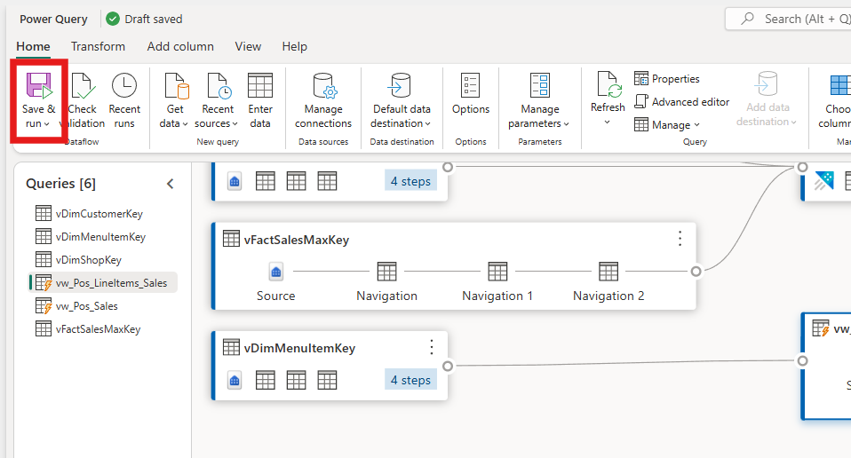

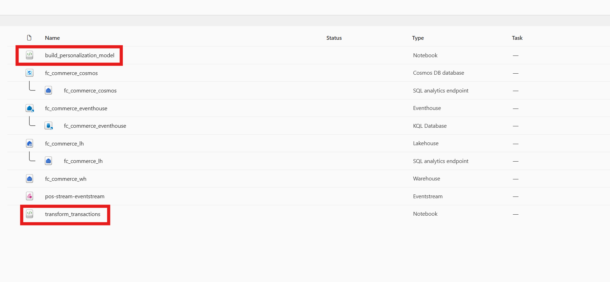

1. Once the notebook has been uploaded, it will appear in the workspace content list. Select the +++*transform_transactions.ipynb*+++ notebook to open it.
