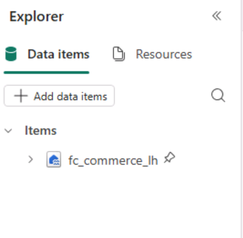
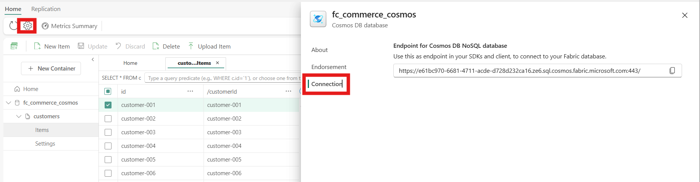

# Exercise 4: Implement Reverse ETL and Build Personalization Model

In this exercise, you will work with Fabric Notebooks to extract and transform data from the Eventhouse, update the user profiles in Cosmos DB, and then use that data to build a personalization model.

by the end of this exercise, you'll be able to:

- Use Fabric Notebooks and Spark to extract and transform data
- Use the Parquet format for staging data in a Lakehouse
- Perform Reverse ETL with Python
- Build a recommendation recommendation model using min-max normalization as part of the preprocessing pipeline.

## Create Data Warehouse Views

1. In your Fabric workspace, navigate to the Data Warehouse where you want to create views.
1. Create a new SQL query by selecting the **New SQL Query** button in the warehouse page.


1. In the query window editor, paste the following SQL code to create views in the warehouse:

```sql
CREATE OR ALTER VIEW dbo.vDimCustomerKey AS 
SELECT CustomerId, CustomerKey, IsActive FROM dbo.DimCustomer;

CREATE OR ALTER VIEW dbo.vDimShopKey AS 
SELECT ShopId, ShopKey, IsActive FROM dbo.DimShop;

CREATE OR ALTER VIEW dbo.vDimMenuItemKey AS 
SELECT MenuItemId, MenuItemKey, IsActive FROM dbo.DimMenuItem;

CREATE OR ALTER VIEW dbo.vFactSalesMaxKey AS 
SELECT
  MaxSalesKey = COALESCE(MAX(SalesKey), 0),
  ExistingTxnCount = COUNT(*)
FROM dbo.FactSales;
```

1. Highlight each command one at a time and select **Run** to execute each command and create the views in the warehouse.

  


## Perform Transformation with Fabric Notebooks

1. From the top menu ribbon, select **→| Import** > **Notebook** > **From this computer**.


1. In the Import status pane, select **Upload**.

1. In the file picker dialog, navigate to the location of this lab's source code folder on your computer, labeled src, then select both the `transform_transactions.ipynb` notebook file and the `build_personalization_model.ipynb` files, then select **Open** to upload them.


1. Once the notebooks have been uploaded, they will appear in the workspace content list. Select the `transform_transactions.ipynb` notebook to open it.

1. On the left side of the notebook, you'll see the Explorer pane, select **Add data items** > **Existing data sources** and select **fc_commerce_lh** to add the Lakehouse as a data source to the notebook.



1. In the notebook, locate the code cells where you need to provide your Fabric environment details. Update the following variables with your specific information:
   - **kustoCluster**: The Kusto cluster URL for your Eventhouse. You can find this in the Eventhouse you configured earlier named `fc_commerce_eventhouse` In the Database Details pane to the right, select **Copy Query URI**.
   
   - **workspace_guid**: The GUID of your Fabric workspace. You can find this in the txt file named **fabric_guids.txt** in the source code folder, or by copying it from the browser address bar when you have your Fabric workspace open (it is the first GUID in the URL).
   - **WAREHOUSE**: `fc_commerce_wh`. You can find this by navigating to your data warehouse in Fabric and copying the database name from the top of the page.
   - **lakehouse_guid**: The GUID of your lakehouse. You can find this in the txt file named **fabric_guids.txt** in the source code folder, or by copying it from the browser address bar when you have your lakehouse open (it is the second GUID in the URL).
   - **SERVER**: The SQL endpoint of your data warehouse. You can find this by navigating to your data warehouse in Fabric, selecting **Settings** from the top menu ribbon, and copying the SQL endpoint from there.
   

1. After updating the variables, run all the cells in the notebook sequentially to perform the data transformation and loading process. You can do this by selecting **Run All** from the top menu ribbon.


1. Once the notebook has finished running, you should see two lakehouse urls printed at the end of the notebook execution. These URLs point to the Parquet files that were created in the lakehouse as part of the transformation process. You will use these files to load data into the data warehouse.


## Load Transformed Data into Data Warehouse
1. Open a new SQL query in your data warehouse by selecting the **New SQL Query** button in the warehouse page.
1. In the query window editor, paste the following SQL code to load the transformed data into the FactSales and FactSalesLineItem tables using the Parquet files created in the previous step. Make sure to replace the placeholder URLs with the actual URLs printed at the end of the notebook execution.

```sql
-- =============================
-- COPY headers (FactSales)
-- =============================
COPY INTO dbo.FactSales
(
    SalesKey             1,
    TransactionId        2,
    DateKey              3,
    TimeKey              4,
    CustomerKey          5,
    ShopKey              6,
    TotalQuantity        7,
    TotalAmount          8,
    PaymentMethod        9,
    LoyaltyPointsEarned 10,
    LoyaltyPointsRedeemed 11,
    CreatedAt           12
)
FROM '[lakehouse sales url]' 
WITH (
    FILE_TYPE = 'PARQUET'
);


-- =============================
-- COPY lines (FactSalesLineItems)
-- =============================
COPY INTO dbo.FactSalesLineItems
(
    TransactionId  1,
    SalesKey       2,
    LineNumber     3,
    DateKey        4,
    TimeKey        5,
    MenuItemKey    6,
    Quantity       7,
    UnitPrice      8,
    LineTotal      9,
    PaymentMethod 10,
    Size          11,
    CreatedAt     12
)
FROM '[lakehouse items urls]' 
WITH (
    FILE_TYPE = 'PARQUET'
);
```

1. Select **Run** to execute the query and load the data into the warehouse.

  

  1. Verify the data in the warehouse by running a few SELECT queries against the FactSales and FactSalesLineItems tables.

  ```sql
  SELECT TOP 10 * FROM dbo.FactSales order by CreatedAt desc;
  SELECT TOP 10 * FROM dbo.FactSalesLineItems order by CreatedAt desc;
  ```

## Reverse ETL and Build Personalization Model
1. Continue to the next notebook in the workspace named `build_personalization_model.ipynb` to perform Reverse ETL and build a personalization model using the transformed data.
1. In the notebook, locate the code cells where you need to provide your Cosmos DB and Data Warehouse details. Update the following variables with your specific information:
   - `COSMOS_ENDPOINT`: The endpoint URL of your Cosmos DB account. You can find this in the Cosmos DB account settings under **Connection String**.
   
   - `WAREHOUSE_SERVER`: The SQL endpoint of your data warehouse. You can find this by navigating to your data warehouse in Fabric, selecting **Settings** from the top menu ribbon, and copying the SQL endpoint from there. You can also use the same value you used in the previous notebook.
1. After updating the variables, run all the cells in the notebook sequentially to perform the Reverse ETL process and build the personalization model. You can do this by selecting **Run All** from the top menu ribbon.

1. Once the notebook has finished running, it will have updated the user profiles in Cosmos DB with the latest transaction data and built a personalization model based on customer purchase patterns.

1. You can verify the updates in Cosmos DB by querying the customers collection to see the updated data.

```sql
SELECT TOP 10 * FROM c ORDER BY c.lastPurchaseDate DESC
```

> If you have time, complete the bonus step by selecting **Next >** in these instructions to go to the next part of the lab: **Exercise 5: IServe Personalized Recommendations from Cosmos DB**.
