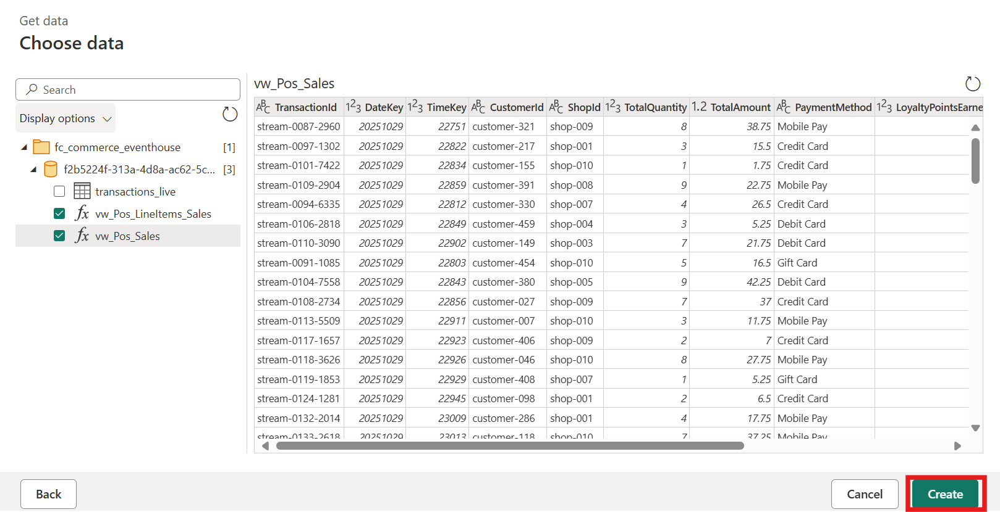
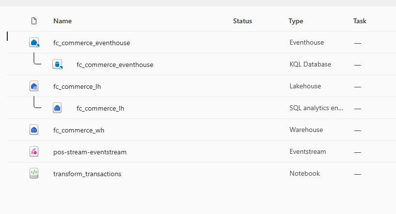

# Implement Reverse ETL and Build Personalization Model

In this exercise, you will create a Dataflow Gen2 to extract and transform data from the Eventhouse, update the user profiles in Cosmos DB, and then use that data to build a personalization model in a notebook.

by the end of this exercise, you'll be able to:

- Create a Dataflow Gen2 to extract and transform data
- Perform Reverse ETL to update user profiles in Cosmos DB

## Create Data Warehouse Views

1. In your Fabric workspace, navigate to the Data Warehouse where you want to create views.
1. Create a new SQL query by selecting the **New SQL Query** button in the warehouse page.

1. In the query window editor, paste the following SQL code to create views in the warehouse:

+++*CREATE OR ALTER VIEW dbo.vDimCustomerKey AS
SELECT CustomerId, CustomerKey, IsActive FROM dbo.DimCustomer;

CREATE OR ALTER VIEW dbo.vDimShopKey AS
SELECT ShopId, ShopKey, IsActive FROM dbo.DimShop;

CREATE OR ALTER VIEW dbo.vDimMenuItemKey AS
SELECT MenuItemId, MenuItemKey, IsActive FROM dbo.DimMenuItem;

CREATE OR ALTER VIEW dbo.vFactSalesMaxKey AS
SELECT
  MaxSalesKey = COALESCE(MAX(SalesKey), 0),
  ExistingTxnCount = COUNT(*)
FROM dbo.FactSales;*+++

1. Select **Run** to execute the query and create the views in the warehouse.

  

## Perform Transformation with Fabric Notebooks

1. Browse to the Fabric workspace you created in the previous steps by selecting it from the left navigation pane if it is already open, or selecting **Workspaces** on the left navigation pane and then selecting it.

1. From the top menu ribbon, select **+ New item**, a pane will open on the right side and on the filter text box on the top right of the pane, type +++*dataflow*+++ to filter the list of items. Select **Dataflow Gen2**.

  

1. Name the new Dataflow +++*fc_commerce_dataflow*+++ and select **Create**.
1. Once the Dataflow Gen2 has been created, it will open in a new tab in Fabric.

## Add Data Sources to Dataflow

1. In the Dataflow canvas, select **Get data from another source** to open the data source selection pane.
1. In the data source selection pane, type +++*eventhouse*+++ in the filter text box to filter the list of items. In the OneLake catalog view, select the eventhouse you created in the previous exercise, +++*fc_commerce_eventhouse*+++.

  

1. In the Choose data pane, expand the folder, then the database, then select the **vw_Pos_Sales** and **vw_Pos_LineItems_Sales** views. Select **Create**.

  

1. In the Dataflow canvas, you will see the two views added as source transformations.
1. In the top menu ribbon, select **New Query** > **Get data** to add another data source.
1. In the OneLake catalog view, type +++*fc_commerce_wh*+++ in the filter text box to filter the list of items. Select the data warehouse you created in the previous exercise, +++*fc_commerce_wh*+++.

  

1. In the Choose data pane, expand the folder, then the database, then select the **vDimCustomerKey**, **vDimShopKey**, **vDimMenuItemKey**, and **vFactSalesMaxKey** views. Select **Create**.

  

## Transform and Load Data in Dataflow

1. In the Dataflow canvas select *vw_Pos_Sales* to see the data preview and transformation options, then right click on the CreatedAt column header and select **Change type** > **Date/Time** from the dropdown.

  

1. Right-click the +++*vw_Pos_Sales*+++ and select **Merge queries**.

  

1. In the Import status pane, select **Upload**.

1. In the file picker dialog, navigate to the location of this lab's source code folder on your computer, labeled src, then select the `transform_transactions.ipynb` notebook file and select **Open** to upload it.

1. Once the notebook has been uploaded, it will appear in the workspace. Select the `transform_transactions.ipynb` notebook to open it.
1. To the left of the notebook, in the Explorer pane select **+ Add data items** > **Existing data sources**.

1. In the OneLake Catalog, select the **fc_commerce_lakehouse** lakehouse and then select **Connect**.

1. In the notebook, locate the code cells where you need to provide your Fabric environment details. Update the following variables with your specific information:
   - `kustoCluster`: The Kusto cluster URL for your Eventhouse. You can find this in the Eventhouse you configured earlier named `fc_commerce_eventhouse` In the Database Details pane to the right, select **Copy Query URI**.
   
   - `workspace_guid`: The GUID of your Fabric workspace. You can find this in the txt file named `fabric_guids.txt` in the source code folder, or by copying it from the browser address bar when you have your Fabric workspace open (it is the first GUID in the URL).
   - `lakehouse_guid`: The GUID of your lakehouse. You can find this in the txt file named `fabric_guids.txt` in the source code folder, or by copying it from the browser address bar when you have your lakehouse open (it is the second GUID in the URL).
   - `SERVER`: The SQL endpoint of your data warehouse. You can find this by navigating to your data warehouse in Fabric, selecting **Settings** from the top menu ribbon, and copying the SQL endpoint from there.
   

1. After updating the variables, run all the cells in the notebook sequentially to perform the data transformation and loading process. You can do this by selecting **Run All** from the top menu ribbon.

1. Once the notebook has finished running, you should see two lakehouse urls printed at the end of the notebook execution. These URLs point to the Parquet files that were created in the lakehouse as part of the transformation process. You will use these files to load data into the data warehouse.

## Load Transformed Data into Data Warehouse
1. Open a new SQL query in your data warehouse by selecting the **New SQL Query** button in the warehouse page.
1. In the query window editor, paste the following SQL code to load the transformed data into the FactSales and FactSalesLineItem tables using the Parquet files created in the previous step. Make sure to replace the placeholder URLs with the actual URLs printed at the end of the notebook execution.

+++*-- =============================
-- COPY headers (FactSales)
-- =============================
COPY INTO dbo.FactSales
(
    SalesKey             1,
    TransactionId        2,
    DateKey              3,
    TimeKey              4,
    CustomerKey          5,
    ShopKey              6,
    TotalQuantity        7,
    TotalAmount          8,
    PaymentMethod        9,
    LoyaltyPointsEarned 10,
    LoyaltyPointsRedeemed 11,
    CreatedAt           12
)
FROM '[lakehouse sales url]' 
WITH (
    FILE_TYPE = 'PARQUET'
);

-- =============================
-- COPY lines (FactSalesLineItems)
-- =============================
COPY INTO dbo.FactSalesLineItems
(
    TransactionId  1,
    SalesKey       2,
    LineNumber     3,
    DateKey        4,
    TimeKey        5,
    MenuItemKey    6,
    Quantity       7,
    UnitPrice      8,
    LineTotal      9,
    PaymentMethod 10,
    Size          11,
    CreatedAt     12
)
FROM '[lakehouse items urls]' 
WITH (
    FILE_TYPE = 'PARQUET'
);*+++

1. Select **Run** to execute the query and load the data into the warehouse.

  

  ## Reverse ETL and Build Personalization Model
1. Continue to the next notebook in the workspace named `build_personalization_model.ipynb` to perform Reverse ETL and build a personalization model using the transformed data.