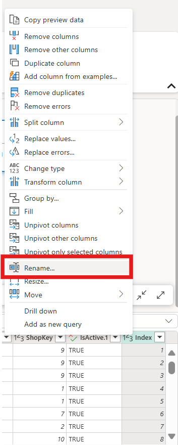

# Implement Reverse ETL and Build Personalization Model
In this exercise, you will create a Dataflow Gen2 to extract and transform data from the Eventhouse, update the user profiles in Cosmos DB, and then use that data to build a personalization model in a notebook.

by the end of this exercise, you'll be able to:
- Create a Dataflow Gen2 to extract and transform data
- Perform Reverse ETL to update user profiles in Cosmos DB
- Build a personalization model in a Fabric notebook

## Create Data Warehouse Views
1. In your Fabric workspace, navigate to the Data Warehouse where you want to create views.
1. Select **New SQL query** from the top menu.
1. In the query window editor, paste the following SQL code to create views:

+++*CREATE OR ALTER VIEW dbo.vDimCustomerKey AS
SELECT CustomerId, CustomerKey, IsActive FROM dbo.DimCustomer;

CREATE OR ALTER VIEW dbo.vDimShopKey AS
SELECT ShopId, ShopKey, IsActive FROM dbo.DimShop;

CREATE OR ALTER VIEW dbo.vDimMenuItemKey AS
SELECT MenuItemId, MenuItemKey, IsActive FROM dbo.DimMenuItem;*+++

1. Select **Run** to execute the query and create the views in the Data Warehouse.

## Create Dataflow Gen2

1. Browse to the Fabric workspace you created in the previous steps by selecting it from the left navigation pane if it is already open, or selecting **Workspaces** on the left navigation pane and then selecting it.

1. From the top menu ribbon, select **+ New item**, a pane will open on the right side and on the filter text box on the top right of the pane, type +++*dataflow*+++ to filter the list of items. Select **Dataflow Gen2**.

1. Name the new Dataflow +++*fc_commerce_dataflow*+++ and select **Create**.
1. Once the Dataflow Gen2 has been created, it will open in a new tab in Fabric.

1. In the Dataflow canvas, select **Get data from another source** to open the data source selection pane.
1. In the data source selection pane, type +++*eventhouse*+++ in the filter text box on the top right of the pane to filter the list of items. In the OneLake catalog view, select the eventhouse you created in the previous exercise, +++*fc_commerce_eventhouse*+++.

1. In the Choose data pane, expand the folder, then the database, then select the +++*vw_Pos_LineItems*+++ view. Select **Create**.

## Transform Data in Dataflow Gen2

1. In the Dataflow canvas, select the +++*vw_Pos_LineItems*+++ view to start transforming the data.
1. Right click on the LineTotal column header and select **Rename**, then enter the new name ++*TotalAmount*++ in the column header.

1. In the vw_Pos_LineItems transformation, select the add destination icon in the top right corner of the transformation box and select **Warehouse**. This opens the Choose destination target pane.

1. Verify **Create new table** is selected in the destination target pane.
1. Expand the warehouse folder and select your warehouse from the list.
1. For the Table name, enter +++*stg_FactSales_Shaped*+++.
1. Select **Next** to open the mapping pane.

1. In the Choose destination settings pane, verify that the Update method is set to **Replace**, the Schema option on publish are set to **Fixed schema**, and that all columns from the source are mapped to the destination,

> [!TIP]
> You may need to set EventTimestamp and CreatedAt to the DateTime data type in the destination mapping.

1. Select **Save settings** to create the warehouse destination.

1. From the top menu ribbon, select **Publish** to publish the Dataflow changes.