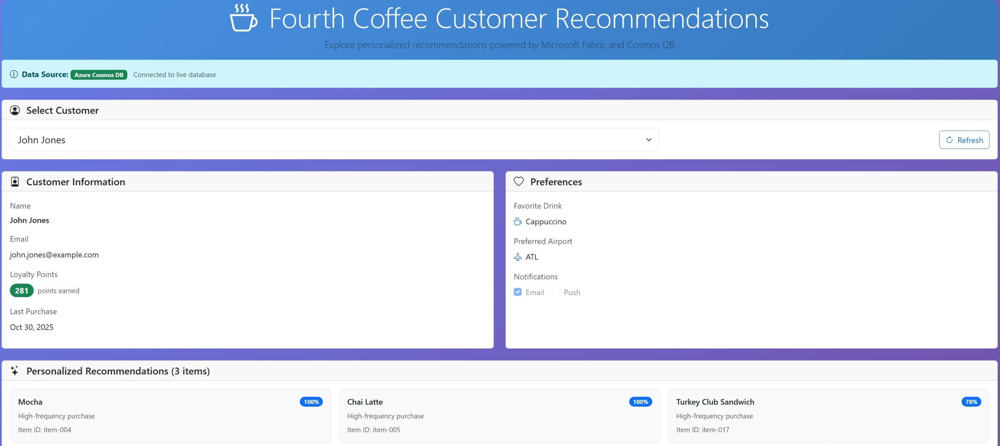

# Exercise 5: Serve Personalized Recommendations from Cosmos DB

In this final exercise, you will enhance the demo application to serve personalized menu item recommendations stored in Microsoft Fabric Cosmos DB. This will allow customers to see AI-generated suggestions based on their preferences and purchase history.

## Configure and Run the Demo Application
1. Open this workshop folder (`lab 354`) in your favorite IDE (e.g., Visual Studio Code).
1. Set the Cosmos DB endpoint environment variable with your endpoint (you can find this in your Fabric workspace under the Cosmos DB connection details):

```bash
$env:CosmosDb:Endpoint="https://YOUR-FABRIC-COSMOS-ENDPOINT.ze6.sql.cosmos.fabric.microsoft.com:443/"
```

1. Run the Application
```bash
dotnet run --project src/app/FourthCoffee.Blazor/FourthCoffee.Blazor.csproj
```

The app will start at `http://localhost:5108` (or as displayed in the console).

