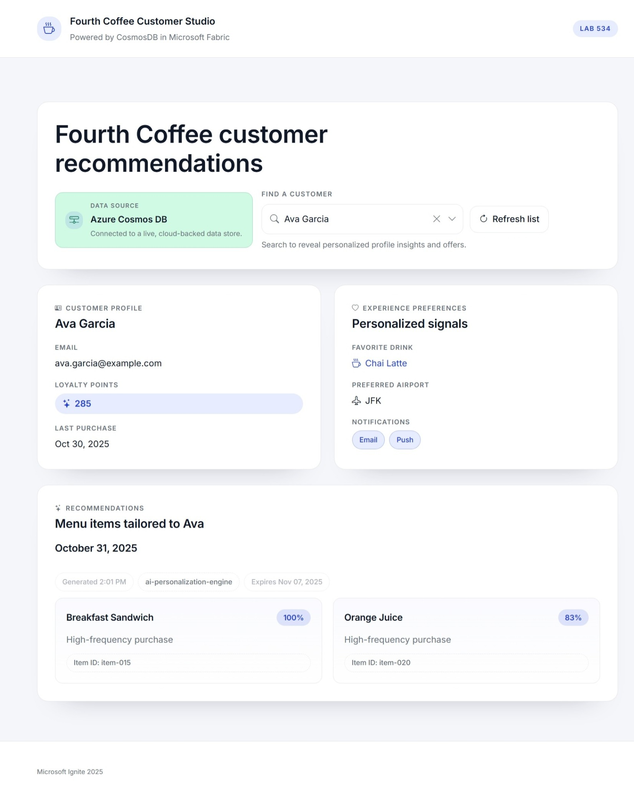

# Exercise 5: Serve Personalized Recommendations from Cosmos DB

In this final exercise, you will enhance the demo application to serve personalized menu item recommendations stored in Microsoft Fabric Cosmos DB. This will allow customers to see AI-generated suggestions based on their preferences and purchase history.

## Configure and Run the Demo Application
1. Open the `src/app` folder in your favorite IDE (e.g., Visual Studio Code).
1. Update the url of the Cosmos DB endpoint in `Program.cs` to point to your Fabric Cosmos DB instance created in Exercise 1. You can find the endpoint URL in the Fabric workspace under the Cosmos DB settings. 

```csharp
builder.Services.AddSingleton<ICustomerService>(provider =>
{
    var endpointUri = "https://YOUR-FABRIC-COSMOS-ENDPOINT.ze6.sql.cosmos.fabric.microsoft.com:443/";
    var databaseName = "fc_commerce_cosmos";
    var containerName = "customers";
    
    try
    {
        return new CosmosDbService(endpointUri, databaseName, containerName);
    }
    catch
    {
        return new LocalJsonCustomerService("wwwroot/data/customers.json");
    }
});
```

1. Run the Application
```bash
dotnet run
```

The app will start at `http://localhost:5000` (or as displayed in the console).

