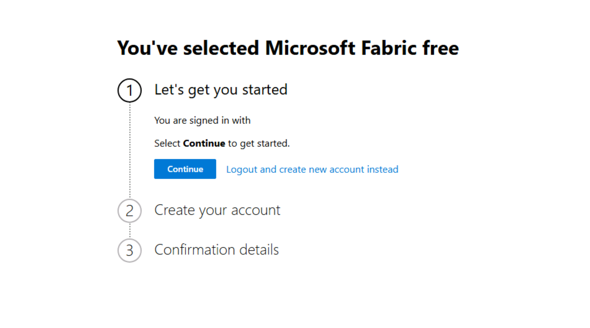
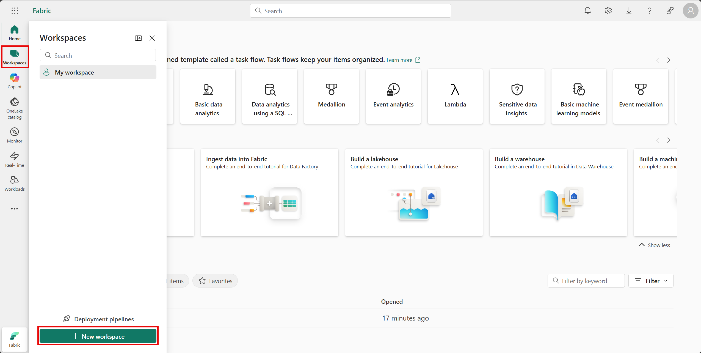
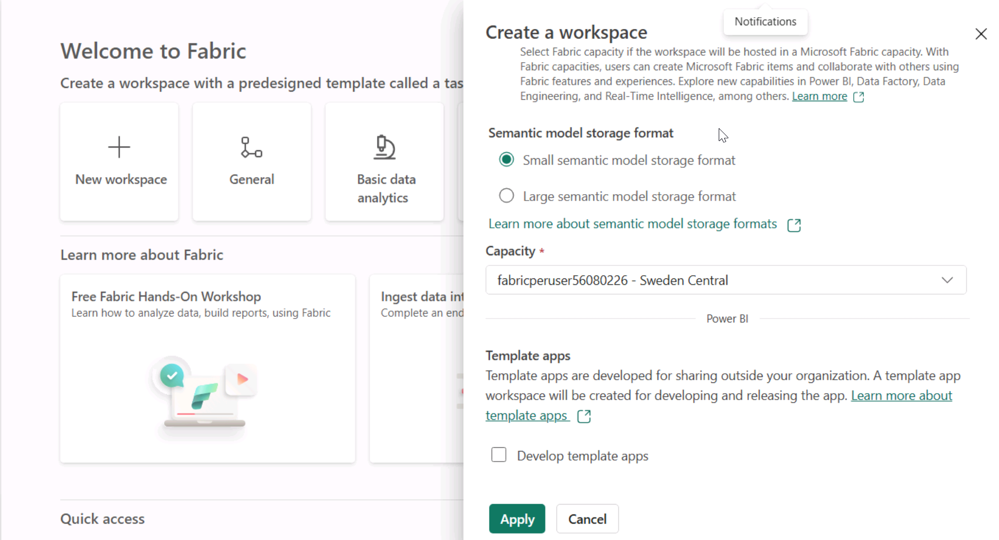
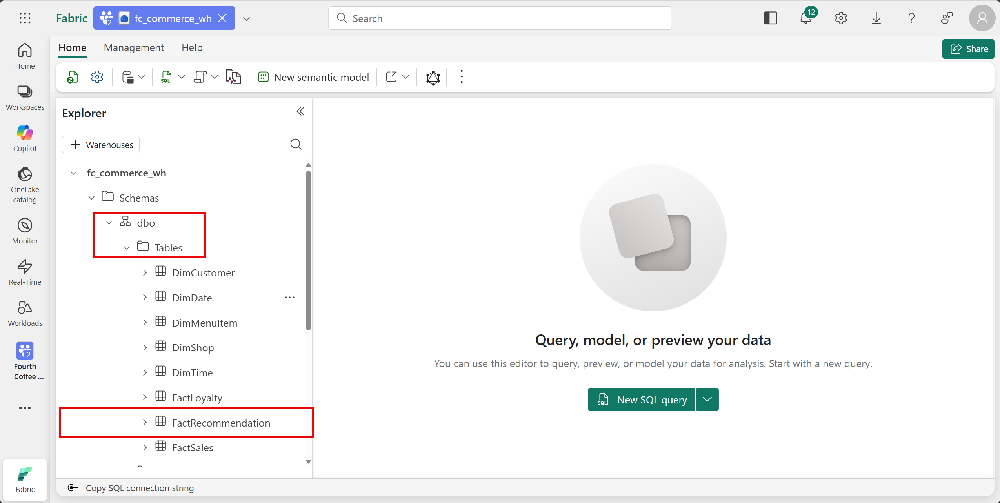

# Fabric Environment Setup

In this first part of the lab, you set up the Microsoft Fabric environment needed to complete the exercises in this lab.

This includes creating a new *Fabric workspace*, automated creation of a *Fabric Warehouse*, and loading data into the Data Warehouse that will be used in later exercises.

## Create a new Fabric Workspace

1. In the virtual machine, open a web browser and browse to +++https://app.fabric.microsoft.com+++.

1. When prompted, sign in using the following credentials:

   - **Email**: +++@lab.CloudPortalCredential(User1).Username+++
   - **Password**: +++@lab.CloudPortalCredential(User1).Password+++

1. Enter your email in the next authentication step, if prompted.

1. If prompted for a Temporary Access Pass, select **Use password** under the textbox and enter your password: +++@lab.CloudPortalCredential(User1).Password+++ .

1. If you come across the Fabric signup prompt, you do not need to fill out the information. Close the tab, open another tab and return to +++https://app.fabric.microsoft.com+++ to get back to the main Fabric UI.

   

1. From the left navigation pane, select **Workspaces**, the select **+ New workspace**.

    

1. Provide +++*Fourth Coffee Commerce - @lab.LabInstance.Id*+++ as the name for the new workspace, expand the **Advanced** section and for the **License mode** select **Fabric capacity** and in the dropdown select the named Fabric capacity then select **Apply**.

     <!--TODO: No screenshot yet add later-->

## Access the lab repository and set up the Fabric Data Warehouse

On your virtual machine, you will find the lab repo pre-cloned on the desktop under the folder named **Desktop > Lab534**. This is the complete lab repository as available on [our repo](https://aka.ms/). <!--TODO: Add aka.ms link to repo-->

1. Right-click on the **Lab534** folder on the desktop and select **Open in Terminal**.

1. Run the following command to authenticate to Microsoft Fabric using Microsoft Entra Id:

    +++*az login --user @lab.CloudPortalCredential(User1).Username --password @lab.CloudPortalCredential(User1).Password*+++

1. In the same terminal window, run the following command to set a new environment variable for your Fabric workspace name:

    +++*$env:FABRIC_WORKSPACE_NAME = "Fourth Coffee Commerce - @lab.LabInstance.Id"*+++

1. In the same terminal window, run the following command to execute the C# file that will create the Fabric Data Warehouse and load data into it:

    +++*dotnet run .\src\warehouse_setup\LoadWarehouseData.cs*+++

    This will take a few minutes to complete. Monitor the terminal output for progress and confirmation of completion.

    > [!TIP]
    > Do not close the terminal windows even after completion. You will use this terminal again in later exercises to avoid setting up the environment variable again.

1. Once the script has completed, navigate back to the Fabric Workspace in the web browser and inside the workspace, notice that two new items have been created: a Fabric Data Warehouse **fc_commerce_wh** and a Fabric Lakehouse **fc_commerce_lh**. Select the **fc_commerce_wh** to open.

1. On the left explorer pane, expand **dbo > Tables** to see the list of tables that have been created and loaded with data. Select any table to preview the data.

    

## Next step

> Select **Next >** in these instructions to go to the next part of the lab: **Exercise 1: Provisioning Cosmos DB in Fabric (Operational Data Store)**.
