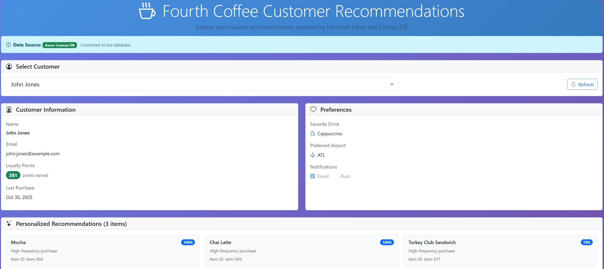

# Fourth Coffee Customer Recommendations App



A **Blazor Server** application that demonstrates personalized customer recommendations powered by **Microsoft Fabric** and **Cosmos DB**. Built for Microsoft Ignite 2025 Lab LAB534.

## Features

- **Dual Data Source Support**: Seamlessly connects to Microsoft Fabric Cosmos DB with automatic local JSON fallback
- **Customer Selection**: Browse customers with intelligent filtering for those with recommendations
- **Customer Profiles**: View detailed customer information including loyalty points, preferences, and purchase history
- **Personalized Recommendations**: Display AI-generated menu item recommendations with confidence scores
- **Responsive Design**: Modern Bootstrap UI with Coffee Shop theming that works on all devices
- **Azure CLI Authentication**: Uses Azure CLI credentials for secure Fabric Cosmos DB access
- **Real-time Data Source Indicator**: Visual badge showing whether you're connected to live database or using sample data

## Prerequisites

- **.NET 8.0 SDK** or later
- **Azure CLI** (for Fabric Cosmos DB authentication)
- **Microsoft Fabric Workspace** with Cosmos DB containing customer data
- **Valid Azure credentials** with access to the Fabric workspace

## Quick Start

### 1. Clone and Navigate
```bash
cd src/app
```

### 2. Authenticate with Azure
```bash
az login
```

### 3. Configure Cosmos DB Connection
Update the endpoint in `Program.cs`:
```csharp
builder.Services.AddSingleton<ICustomerService>(provider =>
{
    var endpointUri = "https://YOUR-FABRIC-COSMOS-ENDPOINT.ze6.sql.cosmos.fabric.microsoft.com:443/";
    var databaseName = "fc_commerce_cosmos";
    var containerName = "customers";
    
    try
    {
        return new CosmosDbService(endpointUri, databaseName, containerName);
    }
    catch
    {
        return new LocalJsonCustomerService("wwwroot/data/customers.json");
    }
});
```

### 4. Run the Application
```bash
dotnet run
```

The app will start at `http://localhost:5000` (or as displayed in the console).


## 🧪 Lab Integration

This demo application showcases the end-to-end data pipeline from Microsoft Ignite 2025 Lab LAB534.
The recommendations displayed are generated by the ML personalization model and delivered through the reverse ETL pipeline built in Exercise 4.
